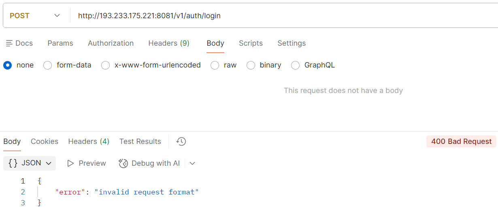
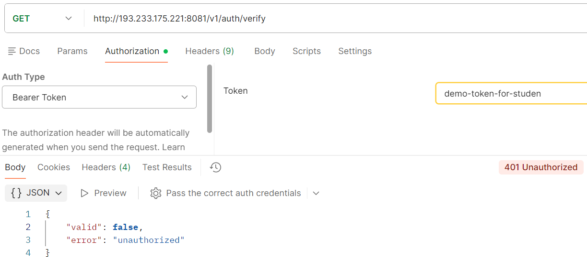
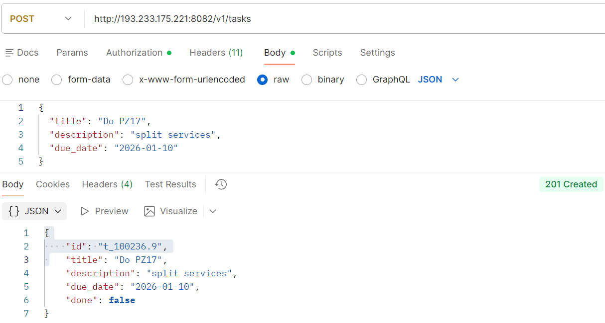

# Практическое занятие №1-2
# Николаенко Михаил ЭФМО-02-25
## Описание проекта

Разделение монолита на 2 микросервиса. Взаимодействие через HTTP. gRPC: создание простого микросервиса, вызовы методов

### Auth Service
Отвечает за аутентификацию и проверку доступа:
- Выдача токенов по учетным данным (упрощенная модель)
- Валидация токенов для других сервисов
- Хранение информации о пользователях (в памяти)

### Tasks Service
Управляет задачами пользователей:
- CRUD операции с задачами
- Хранение задач в памяти (map[id]Task)
- Проверка доступа через Auth Service перед каждой операцией
- Прокидывание request-id для трассировки запросов

### gRPC коммуникация между сервисами

- **Auth service**: работает как gRPC сервер на порту 50051 (параллельно с HTTP)
- **Tasks service**: использует gRPC клиент для проверки токенов
- **Deadline**: каждый вызов имеет таймаут 3 секунды
- **Proto контракт**: описан в `proto/auth.proto`

## Требования

- Go версии 1.25 и выше
- Для работы с командой make в PowerShell необходимо установить менеджер пакетов Chocolatey и установить команду make
- Git

## Команды запуска и сборки
	
### Сгенерировать код из proto файлов
make generate

### Запустить локально
make fast-auth    # Auth на портах HTTP:8081, gRPC:50051
make fast-tasks   # Tasks на порту 8082

### Проверка кода и форматирования
make check

### Показать структуру проекта
make tree

### Показать справку
make help

# Запустить/остановить/перезапустить в Docker
make docker-up

make docker-down

make docker-restart

# Логи общие/Auth/Tasks Docker
make docker-logs

make docker-logs-auth

make docker-logs-tasks

# Остановить/запустить/перезапустить Auth в Docker
make docker-stop-auth

make docker-start-auth 

make docker-restart-auth

## Структура проекта
```
tech-ip-sem2/
├── go.mod
├── go.sum
├── Makefile
├── README.md
├── docker-compose.yml
├── PR1-2-2
├── proto/                          
│   ├── auth.proto                   
│   └── gen/                         
│       └── go/
│           └── auth/
│               ├── auth.pb.go
│               └── auth_grpc.pb.go
├── docs/
│   ├── pz17_diagram.md
│   └── pz17_api.md
├── services/
│   ├── auth/
│   │   ├── Dockerfile
│   │   ├── cmd/
│   │   │   └── auth/
│   │   │       └── main.go
│   │   └── internal/
│   │       ├── grpc/               
│   │       │   └── server.go 
│   │       ├── http/
│   │       │   └── handlers.go
│   │       └── service/
│   │           └── auth.go
│   └── tasks/
│       ├── Dockerfile
│       ├── cmd/
│       │   └── tasks/
│       │       └── main.go
│       └── internal/
│           ├── client/
│           │   └── authclient/
│           │       └── client.go
│           ├── http/
│           │   └── handlers.go
│           └── service/
│               └── tasks.go
└── shared/
    ├── httpx/
    │   └── client.go
    └── middleware/
        ├── logging.go
        └── requestid.go
```
## Скриншоты работы проекта

### Запуск докер контейнеров


### Получение токена доступа

#### Удачное


#### Ошибка авторизации


#### Ошибка формата


### Проверка валидности токена

#### Удачное


#### Ошибка авторизации


### Создание новой задачи


### Получение списка всех задач


### Получение задачи по ID

#### Удачное


#### Не найдено задание


### Обновление задачи


### Удаление задачи


### Verify пошёл через gRPC
