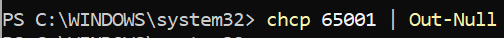
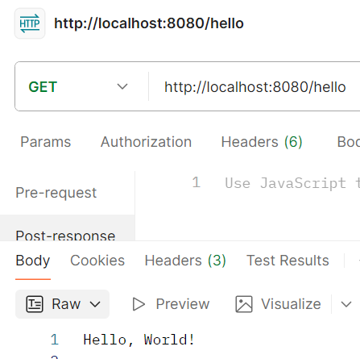
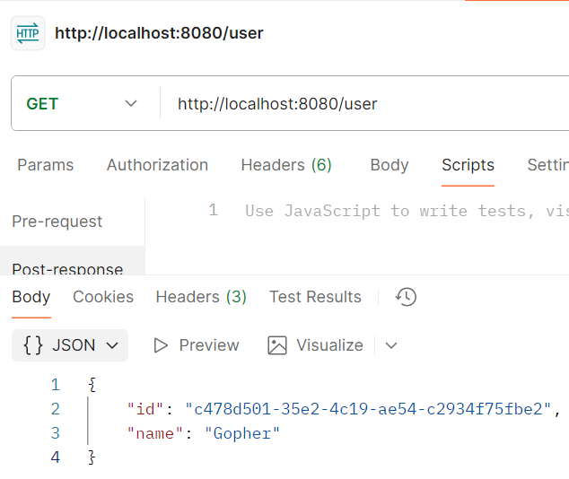
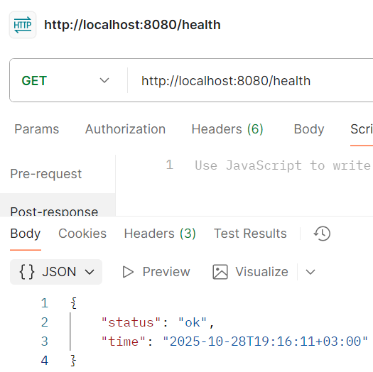
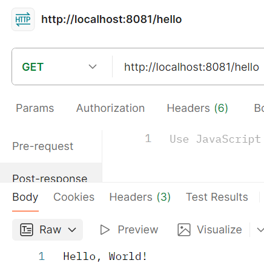
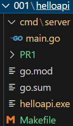

# Практическая работа №1
# Николаенко Михаил ЭФМО-02-25

## Описание проекта и требования

Минимальный HTTP-сервис на Go с использованием net/http и внешней зависимостью для генерации UUID

### Требования

- Go версии 1.21 и выше

- Для работы с командой make в PowerShell необходимо установить менеджер пакетов Chocolatey

## Основные эндпоинты
- `GET /hello` – возвращает простой текстовый ответ.
- `GET /user` – возвращает JSON с информацией о пользователе (UUID и имя).
- `GET /health` – эндпоинт для проверки состояния сервиса, возвращающий JSON с полем "status" и текущим временем в формате RFC3339.

## Команды запуска и сборки

### Сборка приложения

make build

### Запуск приложения (порт из .env или 8080 по умолчанию)

make run

### Запуск на определенном порту

make env PORT=####

### Проверка кода и форматирование

make check

### Быстрая сборка и запуск

make fast

### Показать структуру проекта

make tree

### Помощь

make help

## Примеры запросов

### Вывод "Hello, World!"

http://localhost:8080/hello

Ответ:

{Hello, World!}

### Вывод информации о пользователе

http://localhost:8080/user

Ответ:

{"id": "c8b1f953-2e2a-4c44-b79c-e3ee3288d37f", "name": "Gopher"}


### Проверка состояния сервиса

http://localhost:8080/health

Ответ:

{"status": "ok",
"time": "2025-09-16T19:00:00Z"}


## Структура проекта
```
C:.
│   .env
│   .gitignore
│   go.mod
│   go.sum
│   helloapi.exe
│   Makefile
│   README.md
│
├───cmd
│   └───server
│           main.go
│
└───PR1      
```
## Примечания по конфигурации
- Переменная окружения `APP_PORT` задаёт порт для запуска HTTP сервера.
- По умолчанию сервер слушает на порту 8080.
- Все JSON-ответы содержат правильные заголовки `Content-Type: application/json`.
- Временная метка в `/health` возвращается в формате RFC3339.
- Для изменения порта отредактируйте файл .env или используйте make run-port.

## Скриншоты работы проекта

Проверка наличия ПО


Смена языка консоли



Переход в рабочую папку, инициализация модуля, подтягивание пакета для генерации UUID и запуск сервиса


Проверка эндпоинта "Hello, World!"



Проверка эндпоинта "Пользователь"



Проверка эндпоинта "Состояние сервера"



Проверки форматирования кода и базовая проверка


Изменение порта и запуск сервера на новом порте


Проверка эндпоинта "Hello, World!" на новом порте



Структура проекта

