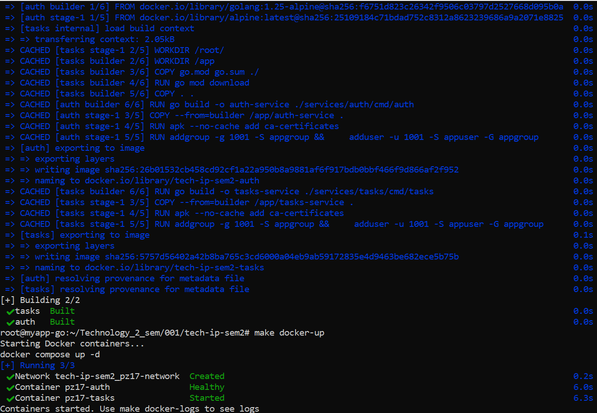
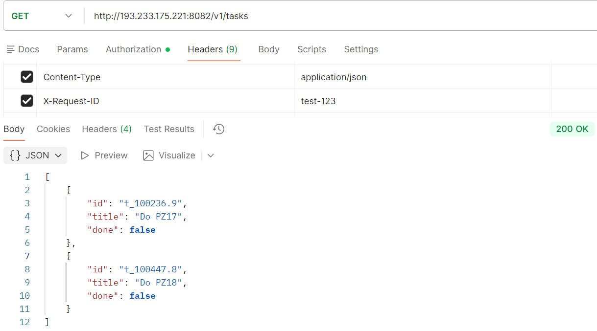
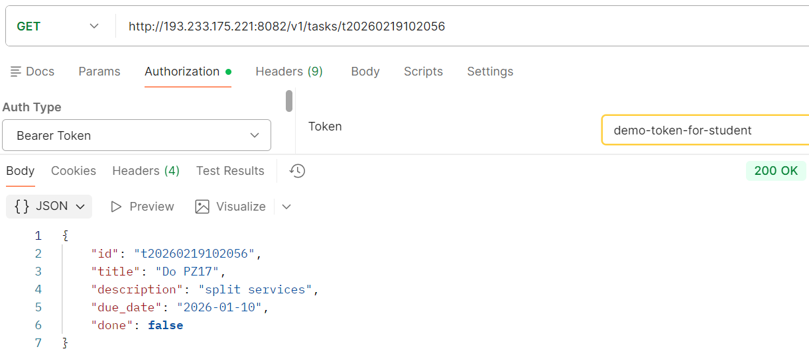

# Практическое занятие №1
# Николаенко Михаил ЭФМО-02-25
## Описание проекта

Разделение монолита на 2 микросервиса. Взаимодействие через HTTP 

### Auth Service
Отвечает за аутентификацию и проверку доступа:
- Выдача токенов по учетным данным (упрощенная модель)
- Валидация токенов для других сервисов
- Хранение информации о пользователях (в памяти)

### Tasks Service
Управляет задачами пользователей:
- CRUD операции с задачами
- Хранение задач в памяти (map[id]Task)
- Проверка доступа через Auth Service перед каждой операцией
- Прокидывание request-id для трассировки запросов

## Требования

- Go версии 1.25 и выше
- Для работы с командой make в PowerShell необходимо установить менеджер пакетов Chocolatey и установить команду make
- Git

## Команды запуска и сборки
	
### Быстрый запуск Терминал 1

make fast-auth

### Быстрый запуск Терминал 2

make fast-tasks

### Проверка кода и форматирования

make check

### Показать структуру проекта

make tree

### Показать справку

make help

## Структура проекта
```
tech-ip-sem2/
├── go.mod
├── go.sum
├── Makefile
├── README.md
├── docker-compose.yml
├── PR1
├── docs/
│   ├── pz17_diagram.md
│   └── pz17_api.md
├── services/
│   ├── auth/
│   │   ├── Dockerfile
│   │   ├── cmd/
│   │   │   └── auth/
│   │   │       └── main.go
│   │   └── internal/
│   │       ├── http/
│   │       │   └── handlers.go
│   │       └── service/
│   │           └── auth.go
│   └── tasks/
│       ├── Dockerfile
│       ├── cmd/
│       │   └── tasks/
│       │       └── main.go
│       └── internal/
│           ├── client/
│           │   └── authclient/
│           │       └── client.go
│           ├── http/
│           │   └── handlers.go
│           └── service/
│               └── tasks.go
└── shared/
    ├── httpx/
    │   └── client.go
    └── middleware/
        ├── logging.go
        └── requestid.go
```
## Примечания по конфигурации

- `AUTH_PORT`: 8081 — порт для запуска Auth сервиса

- `AUTH_BASE_URL`: http://193.233.175.221:8081 — базовый URL Auth сервиса

- `TASKS_PORT`: 8082 — порт для запуска Tasks сервиса

- `TASKS_BASE_URL`: http://193.233.175.221:8082 — базовый URL Tasks сервиса

## Скриншоты работы проекта

### Запуск докер контейнеров


### Получение токена доступа

#### Удачное


#### Ошибка авторизации


#### Ошибка формата


### Проверка валидности токена

#### Удачное


#### Ошибка авторизации


### Создание новой задачи


### Получение списка всех задач


### Получение задачи по ID
