# Практическая работа №2
# Николаенко Михаил ЭФМО-02-25

## Описание проекта

Минимальный REST-API сервис на Go с правильной структурой проекта, включающий базовые эндпоинты и логирование запросов.

### Требования

- Go версии 1.21 и выше
- Для работы с командой make в PowerShell необходимо установить менеджер пакетов Chocolatey и установить команду make

## Основные эндпоинты
### Простой текстовый ответ
- `GET http://localhost:8080/`

### Информация о состоянии сервера
- `GET http://localhost:8080/ping`

### Информация о состоянии сервера с Request-ID
- `GET http://localhost:8080/ping`
  - `Headers` Key: X-Request-Id Value: demo-123

### Ошибка с HTTP статусом 400 (Bad Request)
- `GET http://localhost:8080/fail`

## Команды запуска и сборки

### Сборка приложения

make build

### Запуск приложения

make run

### Проверка кода и форматирование

make check

### Быстрая сборка и запуск

make fast

### Показать структуру проекта

make tree

### Запуск на определенном порту

make env PORT=####

### Помощь

make help

## Примеры запросов

### Проверка состояния сервера

http://localhost:8080/ping

Ответ:

HTTP/1.1 200 OK

Content-Type: application/json; charset=utf-8

X-Request-Id: 871651eaa2f0db81

Date: Mon, 27 Oct 2025 14:28:56 GMT

Content-Length: 46

{"status": "ok", "time":"2025-09-30T16:55:17Z"}

### Проверка состояния сервера c Request-ID

http://localhost:8080/ping?X-Request-Id=demo-123

Key: X-Request-Id

Value: demo-123

Ответ:

HTTP/1.1 200 OK

Content-Type: application/json; charset=utf-8

X-Request-Id: demo-123

Date: Mon, 27 Oct 2025 14:29:36 GMT

Content-Length: 46

{"status":"ok","time":"2025-10-27T14:29:36Z"}

### Вывод текста

http://localhost:8080/

Ответ:

HTTP/1.1 200 OK

Content-Type: text/plain; charset=utf-8

X-Request-Id: e76276ae7f4062ba

Date: Mon, 27 Oct 2025 14:28:46 GMT

Content-Length: 29

Hello, Go project structure!

### Ошибка

http://localhost:8080/fail

Ответ:

HTTP/1.1 400 Bad Request

Content-Type: application/json; charset=utf-8

X-Request-Id: 27a6dd4602b87003

Date: Mon, 27 Oct 2025 14:29:56 GMT

Content-Length: 32

{"error": "bad_request_example"}

## Структура проекта
```
C:.
│   .env
│   go.mod
│   go.sum
│   Makefile
│   README.md
│
├───bin
│       myapp.exe
│
├───cmd
│   └───myapp
│           main.go
│
├───internal
│   └───app
│       │   app.go
│       │
│       └───handlers
│               ping.go
│
├───PR2
│
└───utils
        httpjson.go
        logger.go
```

## Примечания по конфигурации

- По умолчанию сервер слушает порт 8080.

- Порт можно изменить в параметре http.ListenAndServe(":8080", handler) в файле запуска.

- В проекте используется заголовок HTTP X-Request-Id для передачи уникального ID запроса. Если заголовок не указан, он создается автоматически.

## Скриншоты работы проекта

Проверка наличия ПО

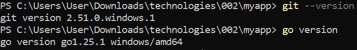

Инициализация проекта

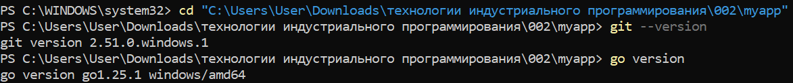

Запуск сервера и логи во время работы

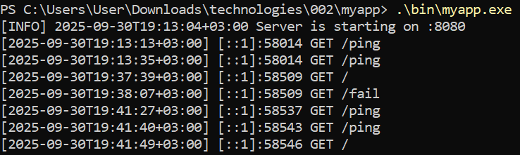

Проверка работы ручек в браузере (вывод текста, /ping, /fail)

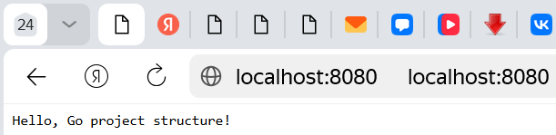

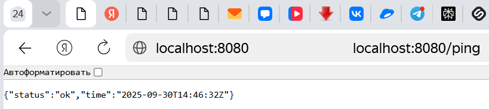

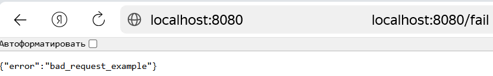

Проверка (/)

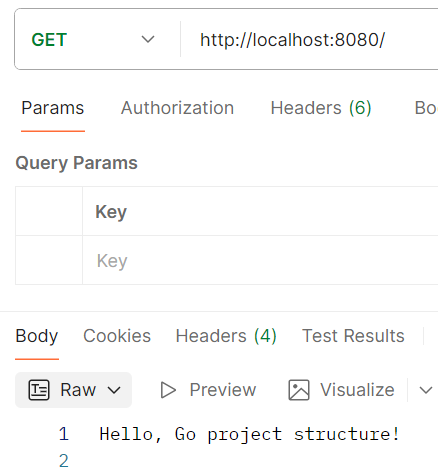

Проверка (/ping)

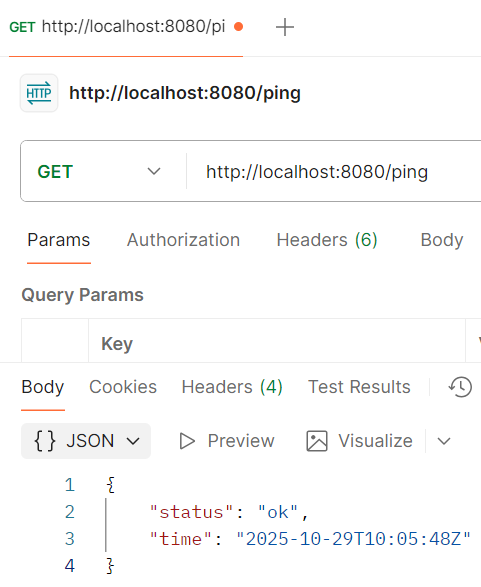

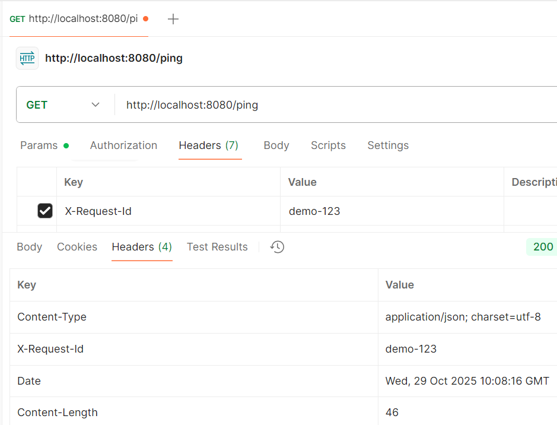

Проверка (/fail)

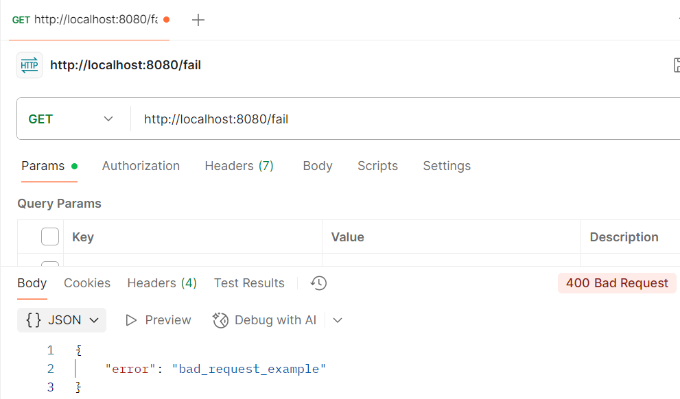

Сборка бинарника и его запуск

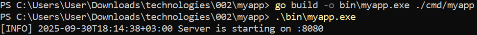

Проверки форматирования кода и базовая проверка

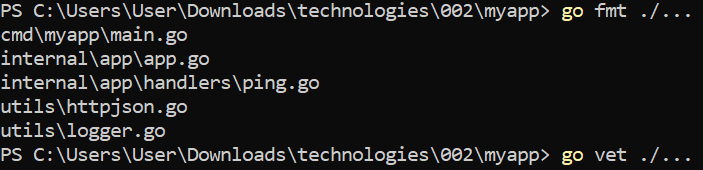

Структура проекта

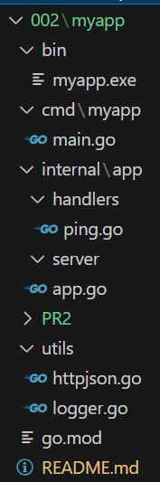