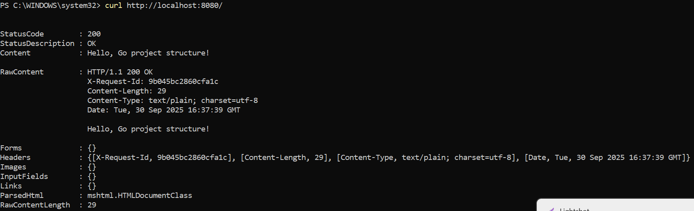
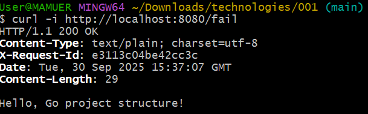
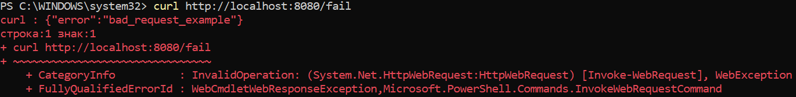
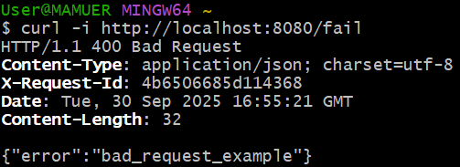
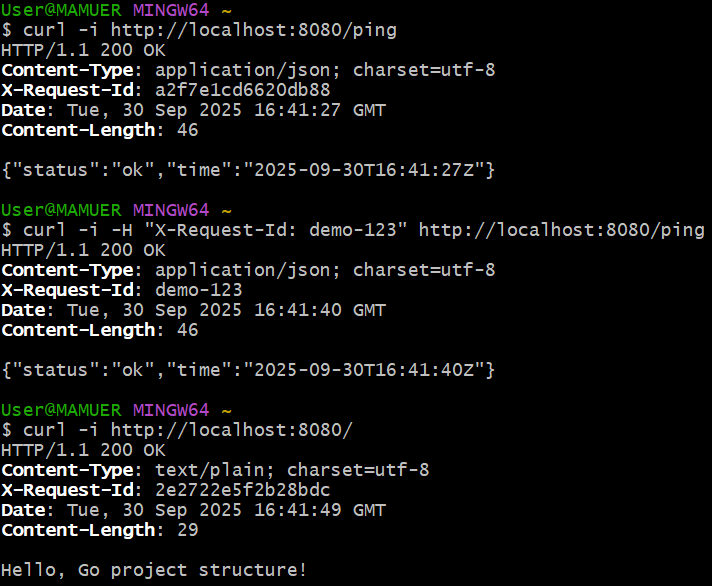

# Практическая работа №2
# Николаенко Михаил ЭФМО-02-21

## Описание проекта и требования

### Требования

Проект представляет собой веб-сервер на Go (необходима версия 1.21 и выше), который выполняет обработку HTTP-запросов и предоставляет базовые API.

## Команды запуска/сборки

### Сборка приложения:

go build -o bin\myapp.exe ./cmd/myapp

### Запуск приложения:

.\bin\myapp.exe

### Примеры запросов:

#### Проверка состояния сервера:

curl http://localhost:8080/ping

Ответ:

{
"status": "ok",
"time": "2025-09-30T15:55:23Z"
}

#### Вывод текста:

curl http://localhost:8080/

Ответ:

Hello, Go project structure!

#### Вывод текста:

curl http://localhost:8080/

Ответ:

Hello, Go project structure!

## Структура проекта
```
C:.
└───myapp
    ├───go.mod
    ├───README.md
    │
    ├───bin
    │   └───myapp.exe
    │
    ├───cmd
    │   └───myapp
    │       └───main.go
    │
    ├───internal
    │   └───app
    │       │───app.go
    │       │
    │       ├───handlers
    │       │   └───ping.go
    │       │
    │       └───server
    ├───PR2
    │
    └───utils
        ├───httpjson.go
        └───logger.go
```

## Примечания по конфигурации

- По умолчанию сервер слушает порт 8080.

- Порт можно изменить в параметре http.ListenAndServe(":8080", handler) в файле запуска.

- В проекте используется заголовок HTTP X-Request-Id для передачи уникального ID запроса. Если заголовок не указан, он создается автоматически.

## Скриншоты работы проекта

Проверка наличия ПО


Инициализация проекта


Запуск сервера и логи во время работы


Проверка работы ручек в браузере (вывод текста и /ping)


Проверка через curl (/)



Проверка через curl (/ping)



Проверка через curl (/fail)



Сборка бинарника и его запуск


Проверка через curl (Запросы через GitBush)




Структура проекта

