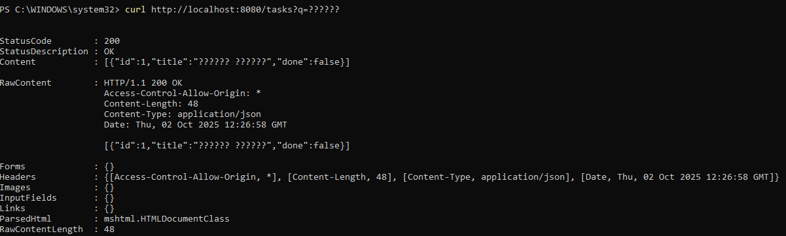
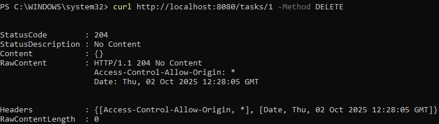
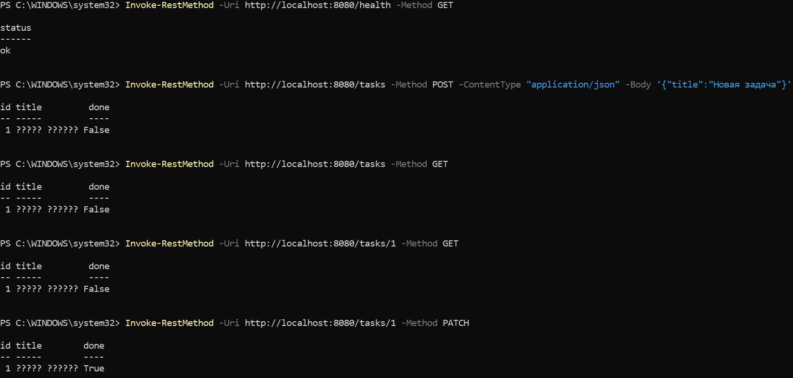
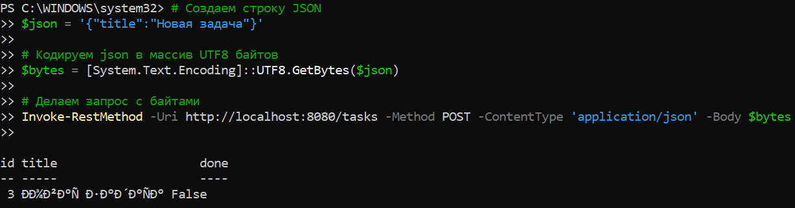
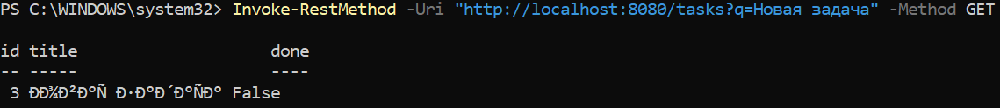
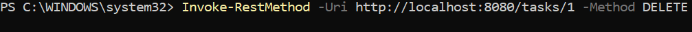
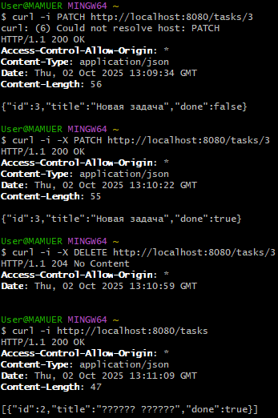

# Практическая работа №3
# Николаенко Михаил ЭФМО-02-25

## Описание проекта и требования

Простой HTTP-сервер для управления задачами (To-Do list) на стандартной библиотеке Go net/http с поддеркой CRUD операций и фильтрацией.

### Требования
- Go версии 1.21 и выше
- Для работы с командой make в PowerShell необходимо установить менеджер пакетов Chocolatey и установить команду make

## Основные эндпоинты
- `GET /health` – проверка состояния сервера
- `GET /tasks` – получение списка всех задач (с поддержкой фильтрации)
- `POST /tasks` – создание новой задачи
- `GET /tasks/{id}` – получение конкретной задачи по ID
- `PATCH /tasks/{id}` – отметить задачу выполненной
- `DELETE /tasks/{id}` – удалить задачу

## Команды запуска и сборки

### Сборка приложения

make build

### Запуск приложения

make run

### Проверка кода и форматирование

make check

### Быстрая сборка и запуск

make fast

### Показать структуру проекта

make tree

### Запуск на определенном порту

make env PORT=####

### Помощь

make help

## Примеры запросов:

### Проверка состояния сервера:

curl http://localhost:8080/health

Ответ:

{
  "status": "ok"
}

### Получение списка задач:

curl http://localhost:8080/tasks

Ответ:

[{
  "id":1,"title":"TEXT","done":false},
  {"id":2,"title":"TEXT","done":false},
...}]

### Создание новой задачи:

curl -X POST http://localhost:8080/tasks -H "Content-Type: application/json" -d "{\"title\":\"TEXT\"}"

Ответ:

{
  "id":1,"title":"TEXT","done":false
}

### Получение задачи по ID:

curl http://localhost:8080/tasks/1

Ответ:

{
  "id":1,"title":"TEXT","done":false
}

### Отметить задачу выполненной:

curl -X PATCH http://localhost:8080/tasks/1

Ответ:

{
  "id":1,"title":"TEXT","done":true
}

### Поиск задач с фильтром:

curl http://localhost:8080/tasks?q=TEXT

Ответ:

{
  "id":1,"title":"TEXT","done":false
}

### Удалить задачу:

curl -X DELETE http://localhost:8080/tasks/1

## Структура проекта
```
C:.
│   .env
│   go.mod
│   go.sum
│   Makefile
│   README.md
│   requests.md
│
├───bin
│       server.exe
│
├───cmd
│   └───server
│           main.go
│
├───internal
│   ├───api
│   │       add.go
│   │       handlers.go
│   │       handlers_test.go
│   │       middleware.go
│   │       responses.go
│   │
│   └───storage
│           memory.go
│
└───PR3
```

## Примечания по конфигурации

- По умолчанию сервер слушает порт 8080.

- Переменная окружения `PORT` задаёт порт для запуска HTTP сервера.

## Скриншоты работы проекта

Проверка наличия ПО (+ установка доп. ПО)


Инициализация проекта (+ сборка и проверка)


Запуск сервера и логи во время работы


Проверка через curl (/health)


Создание задачи через curl (/tasks -POST)


Проверка через curl (/tasks)


Проверка через curl (/tasks/{id})


Проверка через curl (/tasks?q=TEXT)



Проверка через curl (/tasks/{id} -DELETE)



Проверка через curl (/tasks/{id} -PATCH)


Проверка через Invoke-RestMethod









Проверка через curl (Запросы через GitBush)




Проверки форматирования кода и базовая проверка


Структура проекта

