# Практическая работа №3
# Николаенко Михаил ЭФМО-02-25

## Описание проекта

Простой HTTP-сервер для управления задачами (To-Do list) на стандартной библиотеке Go net/http с поддеркой CRUD операций и фильтрацией.

## Требования
- Go версии 1.21 и выше
- Для работы с командой make в PowerShell необходимо установить менеджер пакетов Chocolatey и установить команду make

## Основные эндпоинты
### Проверка состояния сервера
- `GET http://localhost:8080/health`

### Создание новой задачи
- `POST http://localhost:8080/tasks`
  - `Headers` Key: Content-Type Value: application/json
  - `Body`: {"title": "TEXT"}

### Получение списка всех задач
- `GET http://localhost:8080/tasks`

### Получение списка всех задач с фильтром
- `GET http://localhost:8080/tasks?q=TEXT`

### Получение конкретной задачи по ID
- `GET http://localhost:8080/tasks/1`

### Отметить задачу выполненной
- `PATCH http://localhost:8080/tasks/1`

### Удалить задачу
- `DELETE http://localhost:8080/tasks/1`

## Команды запуска и сборки

### Сборка приложения

make build

### Запуск приложения

make run

### Проверка кода и форматирование

make check

### Быстрая сборка и запуск

make fast

### Показать структуру проекта

make tree

### Запуск на определенном порту

make env PORT=####

### Помощь

make help

## Примеры запросов:

### Проверка состояния сервера:

http://localhost:8080/health

Ответ:

{
  "status": "ok"
}

### Получение списка задач:

http://localhost:8080/tasks

Ответ:

[{"id":1,"title":"TEXT","done":false},{"id":2,"title":"TEXT","done":false},...}]

### Создание новой задачи:

http://localhost:8080/tasks

Key: Content-Type

Value: application/json

Ответ:

{
  "id":1,"title":"TEXT","done":false
}

### Получение задачи по ID:

http://localhost:8080/tasks/1

Ответ:

{
  "id":1,"title":"TEXT","done":false
}

### Отметить задачу выполненной:

http://localhost:8080/tasks/1

Key: Content-Type

Value: application/json

Ответ:

{
  "id":1,"title":"TEXT","done":true
}

### Поиск задач с фильтром:

http://localhost:8080/tasks?q=TEXT

Ответ:

{
  "id":1,"title":"TEXT","done":false
}

### Удалить задачу:

http://localhost:8080/tasks/1

## Структура проекта
```
.
├── bin
│   └── server.exe
├── cmd
│   └── server
│       └── main.go
├── go.mod
├── go.sum
├── internal
│   ├── api
│   │   ├── add.go
│   │   ├── handlers.go
│   │   ├── handlers_test.go
│   │   ├── middleware.go
│   │   └── responses.go
│   └── storage
│       └── memory.go
├── Makefile
├── PR3
├── README.md
└── requests.md
```

## Примечания по конфигурации

- По умолчанию сервер слушает порт 8080.

- Переменная окружения `PORT` задаёт порт для запуска HTTP сервера.

## Скриншоты работы проекта

Проверка наличия ПО (+ установка доп. ПО)


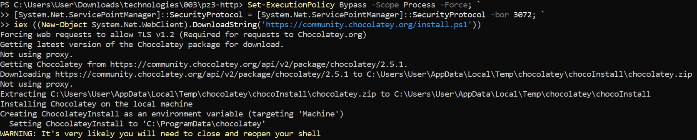

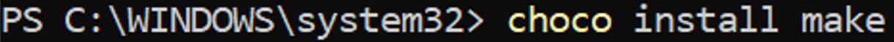

Инициализация проекта (+ сборка и проверка)


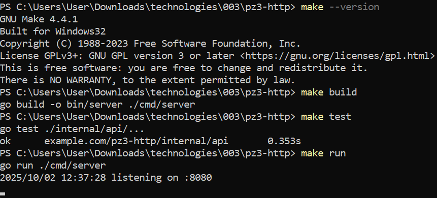

Запуск сервера и логи во время работы


Проверка через (/health)

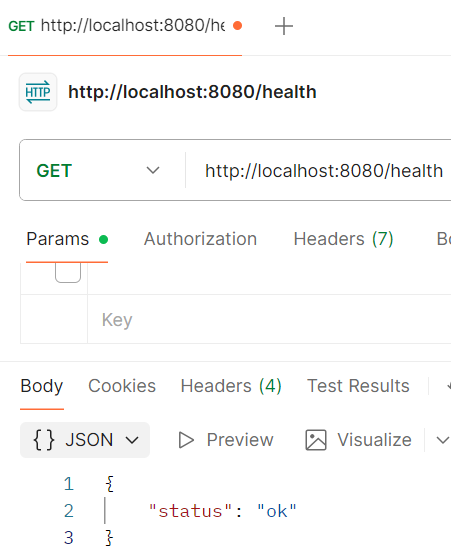

Создание задачи через (/tasks -POST)

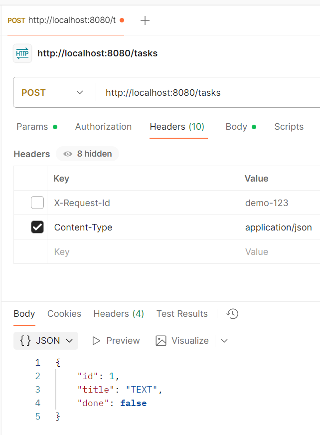

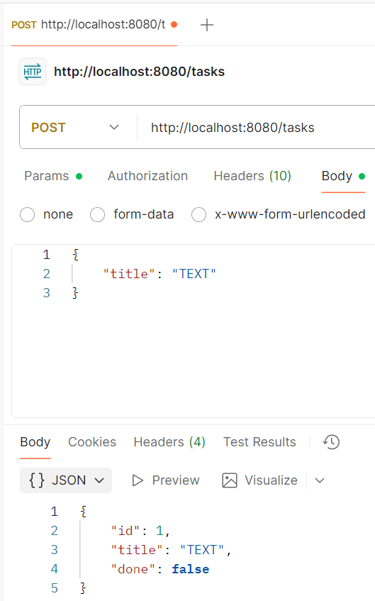

Проверка через (/tasks)

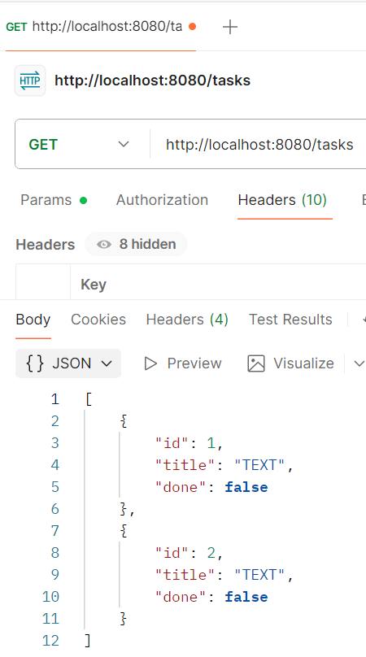

Проверка через (/tasks/{id})

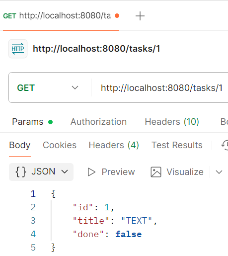

Проверка через (/tasks?q=TEXT)

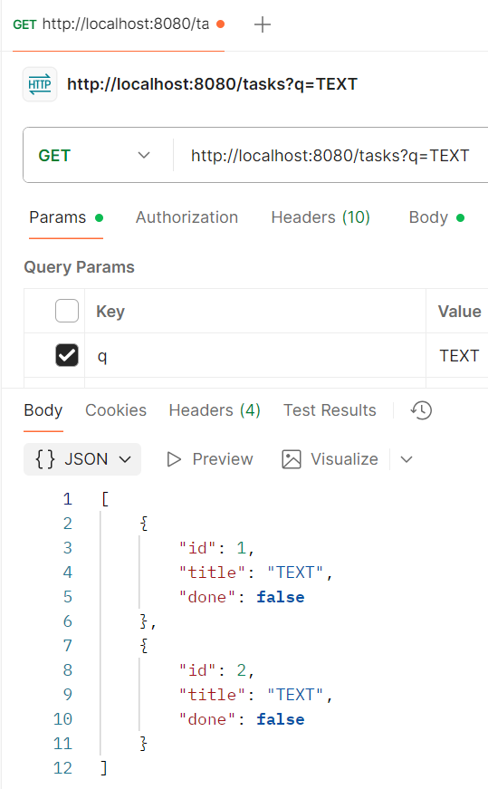

Проверка через (/tasks/{id} -DELETE)

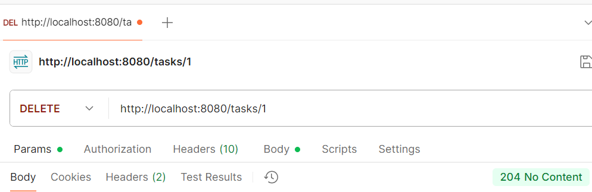

Проверка через (/tasks/{id} -PATCH)

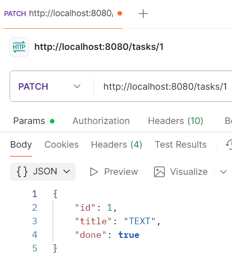

Проверки форматирования кода и базовая проверка

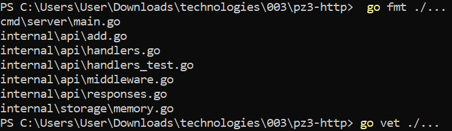

Структура проекта

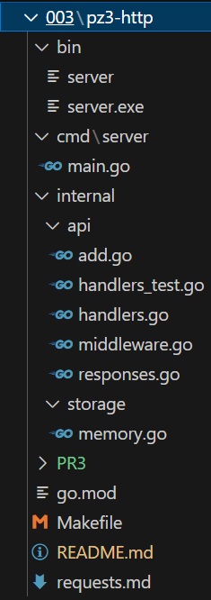