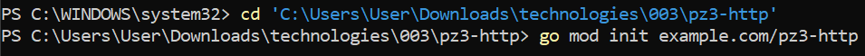
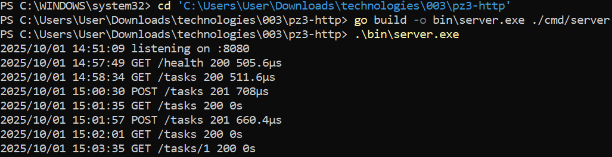
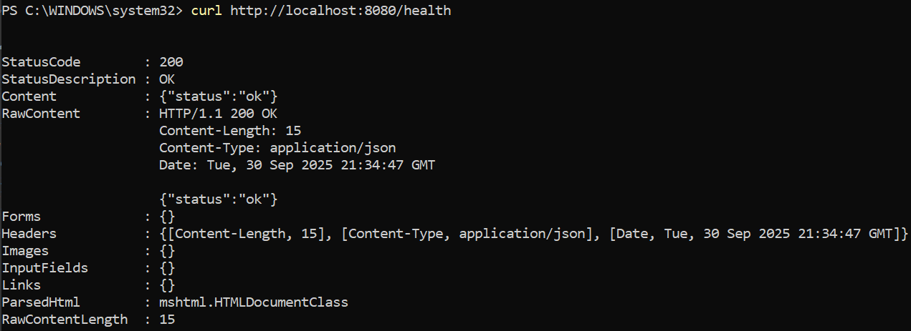
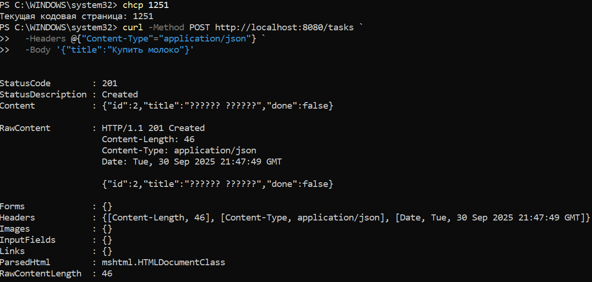
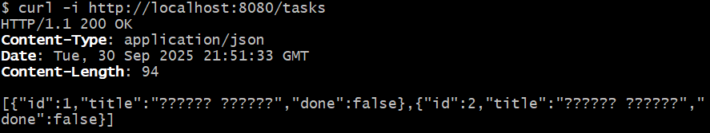
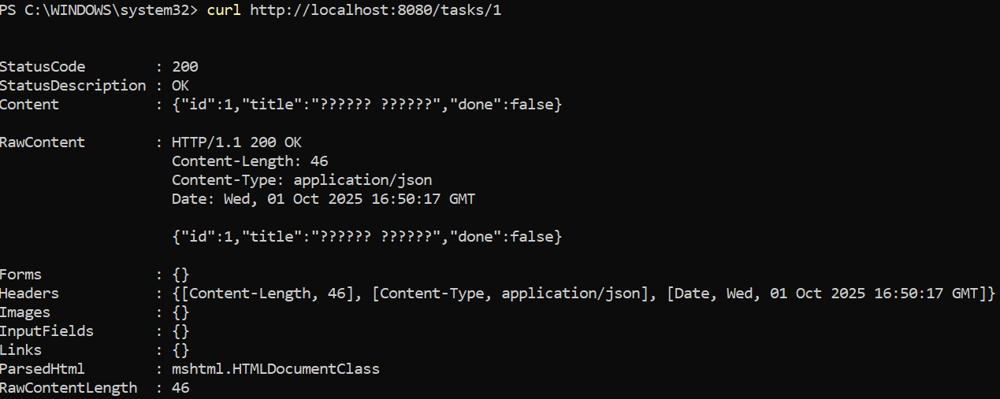
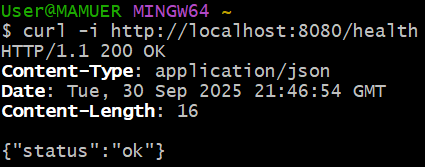
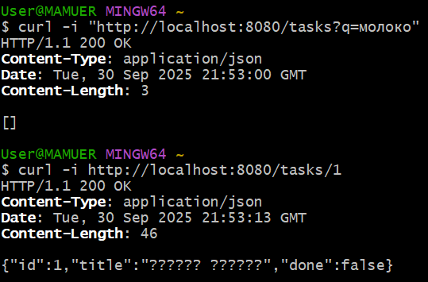
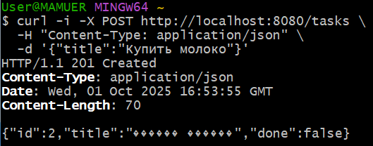
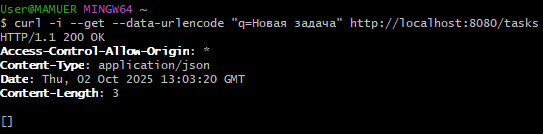

# Практическая работа №3
# Николаенко Михаил ЭФМО-02-21

## Описание проекта и требования

### Требования

Проект представляет собой простой HTTP-сервер на языке Go (необходима версия 1.21 и выше) с REST-API:

Основные эндпоинты:

- `GET /health` – проверка состояния сервера.
- `GET /tasks` – получение списка всех задач.
- `POST /tasks` – создание новой задачи.
- `GET /tasks/{id}` – получение конкретной задачи по ID.

## Команды запуска и сборки

### Сборка приложения:

go build -o bin\server.exe ./cmd/server

### Запуск приложения:

.\bin\server.exe

### Примеры запросов:

#### Проверка состояния сервера:

curl http://localhost:8080/health

Ответ:

{
  "status": "ok"
}

#### Получение списка задач:

curl http://localhost:8080/tasks

Ответ:

[{
  "id":1,"title":"TEXT","done":false},
  {"id":2,"title":"TEXT","done":false},
...}]

#### Создание новой задачи:

curl -Method POST http://localhost:8080/tasks `
  -Headers @{"Content-Type"="application/json"} `
  -Body '{"title":"TEXT"}'

Ответ:

{
  "id":1,"title":"TEXT","done":false
}

#### Получение задачи по ID:

curl http://localhost:8080/tasks/1

Ответ:

{
  "id":1,"title":"TEXT","done":false
}

## Структура проекта
```
C:.
└───pz3-http
    ├───go.mod
    ├───README.md
    │
    ├───bin
    │   ├───http.exe
    │   └───server.exe
    │
    ├───cmd
    │   └───server
    │       └───main.go
    │
    ├───internal
    │   ├───api
    │   │   ├───handlers.go
    │   │   ├───middleware.go
    │   │   └───responses.go
    │   │
    │   └───storage
    │       └───memory.go
    │
    └───PR3
```

## Примечания по конфигурации

- Сервер использует память для хранения данных (in-memory storage) и логирует все входящие запросы.

- По умолчанию сервер слушает порт 8080.

- Порт можно изменить в параметре http.ListenAndServe(":8080", handler) в main.go.

- Используется middleware для логирования запросов


## Скриншоты работы проекта

Инициализация проекта



Запуск сервера и логи во время работы



Проверка через curl (/health)



Создание задачи через curl (/tasks)



Проверка через curl (/tasks)



Проверка через curl (/tasks/{id})



Проверка через curl (Запросы через GitBush)






Структура проекта

