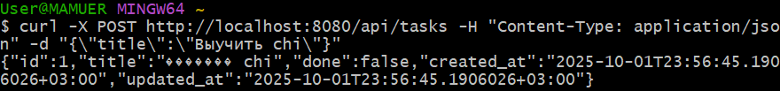
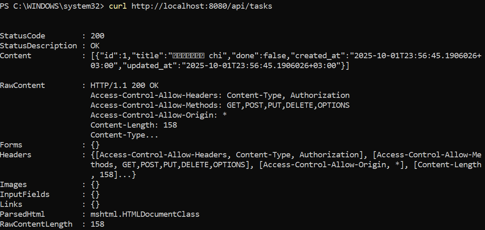
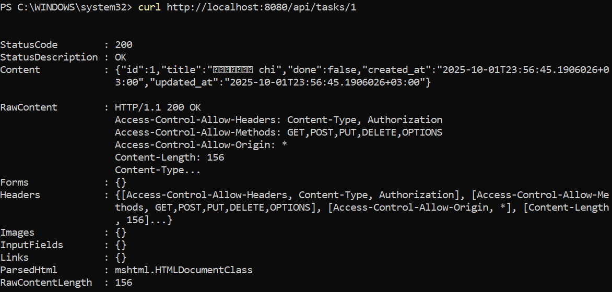
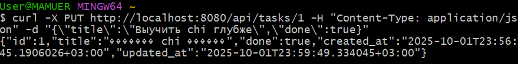
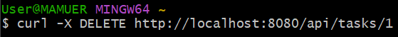
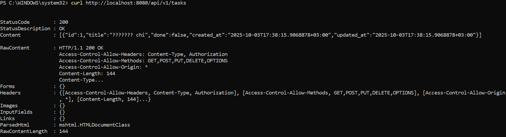
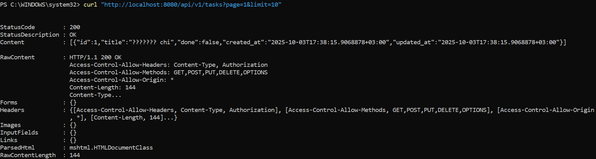
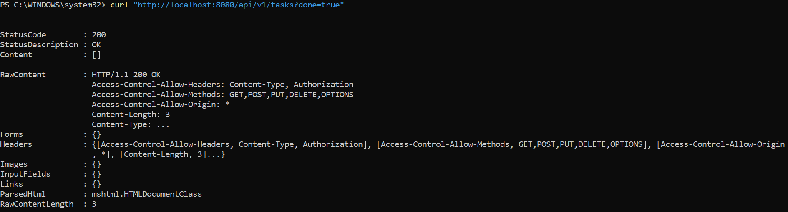
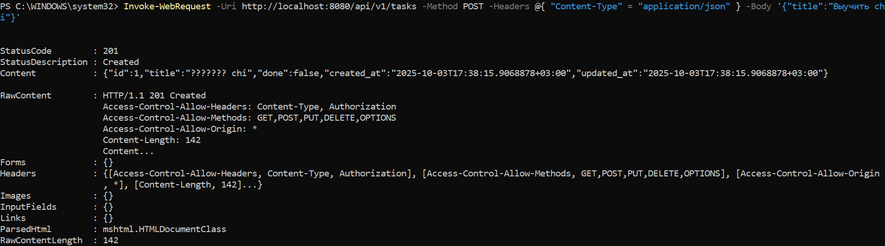

# Практическая работа №3
# Николаенко Михаил ЭФМО-02-21

## Описание проекта и требования

### Требования

Для работы с командой make в PowerShell необходимо установить менеджер пакетов Chocolatey и установить команду make

Проект представляет собой простой HTTP-сервер на языке Go (необходима версия 1.21 и выше) с REST-API:

Основные эндпоинты:

- `GET /health` – проверка состояния сервера.
- `GET /tasks` – получение списка всех задач.
- `POST /tasks` – создание новой задачи.
- `GET /tasks/{id}` – получение конкретной задачи по ID.
- `PATCH /tasks/{id}` – отметить задачу выполненной.
- `GET /tasks?q=TEXT` – поиск задач с фильтром.
- `DELETE /tasks/{id}` – удалить задачу.

## Команды запуска и сборки

### Сборка приложения:

go build -o bin\server.exe ./cmd/server

### Запуск приложения:

.\bin\server.exe

### Примеры запросов:

#### Проверка состояния сервера:

curl http://localhost:8080/health

Ответ:

{
  "status": "ok"
}

#### Получение списка задач:

curl http://localhost:8080/tasks

Ответ:

[{
  "id":1,"title":"TEXT","done":false},
  {"id":2,"title":"TEXT","done":false},
...}]

#### Создание новой задачи:

curl -Method POST http://localhost:8080/tasks `
  -Headers @{"Content-Type"="application/json"} `
  -Body '{"title":"TEXT"}'

Ответ:

{
  "id":1,"title":"TEXT","done":false
}

#### Получение задачи по ID:

curl http://localhost:8080/tasks/1

Ответ:

{
  "id":1,"title":"TEXT","done":false
}

#### Отметить задачу выполненной:

curl http://localhost:8080/tasks/1 -Method PATCH

Ответ:

{
  "id":1,"title":"TEXT","done":true
}

#### Поиск задач с фильтром:

curl http://localhost:8080/tasks/1

Ответ:

{
  "id":1,"title":"TEXT","done":false
}

#### Удалить задачу:

curl http://localhost:8080/tasks/1 -Method DELETE

## Структура проекта
```
C:.
└───pz3-http
    ├───go.mod
    ├───README.md
    ├───requests.md
    ├───Makefile
    │
    ├───bin
    │   └───server.exe
    │
    ├───cmd
    │   └───server
    │       └───main.go
    │
    ├───internal
    │   ├───api
    │   │   ├───handlers.go
    │   │   ├───middleware.go
    │   │   ├───add.go
    │   │   ├───handlers_test.go
    │   │   └───responses.go
    │   │
    │   └───storage
    │       └───memory.go
    │
    └───PR4
```

## Примечания по конфигурации

- Сервер использует память для хранения данных (in-memory storage) и логирует все входящие запросы.

- По умолчанию сервер слушает порт 8080.

- Переменная окружения `PORT` задаёт порт для запуска HTTP сервера.

- Используется middleware для логирования запросов

## Скриншоты работы проекта

Инициализация модуля и установка зависимостей


Запуск и логи проекта


Проверка в браузере (/health)


Создание задачи через curl (/tasks -POST)



Проверка через curl (/tasks)



Проверка через curl (/tasks/{id})



Обновление задачи через curl (/tasks/{id} -PUT)



Удаление задачи через curl (/tasks/{id} -DELETE)



Проверка через curl (/tasks/{id} -PATCH)


Проверка через Invoke-RestMethod








Проверка через curl (Запросы через GitBush)





Структура проекта

