# Практическая работа №4
# Николаенко Михаил ЭФМО-02-25

## Описание проекта и требования

Реализация CRUD-сервиса "Список задач" с использованием роутера chi для маршрутизации, middleware для логирования и CORS, а также in-memory хранилища с сохранением состояния.

### Требования
- Go версии 1.21 и выше
- Для работы с командой make в PowerShell необходимо установить менеджер пакетов Chocolatey и установить команду make

## Основные эндпоинты
- `GET http://localhost:8080/health` – проверка состояния сервера.
- `POST http://localhost:8080/api/v1/tasks` с параметрами `Headers` Key: Content-Type Value: application/json и`Body`: {"title": "TEXT"} – создание новой задачи
- `GET http://localhost:8080/api/v1/tasks?page=1&limit=10&done=false` – получение списка всех задач с пагинацией.
- `GET http://localhost:8080/api/v1/tasks` – получение списка всех задач.
- `PUT http://localhost:8080/api/v1/tasks/1` с параметрами `Headers` Key: Content-Type Value: application/json и`Body`: {"title": "NEWTEXT","done": true} – изменить текст задачи.
- `GET http://localhost:8080/api/v1/tasks/1` – получение конкретной задачи по ID
- `PATCH http://localhost:8080/api/v1/tasks/1` – отметить задачу выполненной
- `GET http://localhost:8080/api/v1/tasks?q=TEXT` – получение списка всех задач с фильтром
- `DELETE http://localhost:8080/api/v1/tasks/1` – удалить задачу

## Команды запуска и сборки

#### Сборка приложения

make build

### Запуск приложения

make run

### Проверка кода и форматирование

make check

### Быстрая сборка и запуск

make fast

### Показать структуру проекта

make tree

### Запуск тестов

make test

### Помощь

make help

## Примеры запросов

### Проверка состояния сервера

http://localhost:8080/health

Ответ:

OK

### Получение списка задач с пагинацией и фильтром

http://localhost:8080/api/v1/tasks?page=1&limit=10&done=false

[{"id":1,"title":"??????? chi","done":false,"created_at":"2025-10-03T17:38:15.9068878+03:00","updated_at":"2025-10-03T17:38:15.9068878+03:00"},{"id":2,"title":"TEXT","done":false,"created_at":"2025-10-28T18:07:39.8530126+03:00","updated_at":"2025-10-28T18:07:39.8530126+03:00"}]

### Получение списка задач

http://localhost:8080/api/v1/tasks

Ответ:

[{"id":1,"title":"??????? chi","done":false,"created_at":"2025-10-03T17:38:15.9068878+03:00","updated_at":"2025-10-03T17:38:15.9068878+03:00"},{"id":2,"title":"TEXT","done":false,"created_at":"2025-10-28T18:07:39.8530126+03:00","updated_at":"2025-10-28T18:07:39.8530126+03:00"}]

### Создание новой задачи

http://localhost:8080/api/v1/tasks

Ответ:

{"id":2,"title":"TEXT","done":false,"created_at":"2025-10-28T18:07:39.8530126+03:00","updated_at":"2025-10-28T18:07:39.8530126+03:00"}

### Обновление задачи

http://localhost:8080/api/v1/tasks/1

#### Получение задачи по ID

http://localhost:8080/api/v1/tasks/1

Ответ:

{"id":1,"title":"NEWTEXT","done":true,"created_at":"2025-10-03T17:38:15.9068878+03:00","updated_at":"2025-10-28T18:09:09.4388096+03:00"}

### Отметить задачу выполненной

http://localhost:8080/api/v1/tasks/1

### Поиск задач с фильтром

http://localhost:8080/api/v1/tasks?q=TEXT

Ответ:

[{"id":1,"title":"NEWTEXT","done":true,"created_at":"2025-10-03T17:38:15.9068878+03:00","updated_at":"2025-10-28T18:09:09.4388096+03:00"},{"id":2,"title":"TEXT","done":false,"created_at":"2025-10-28T18:07:39.8530126+03:00","updated_at":"2025-10-28T18:07:39.8530126+03:00"}]

### Удалить задачу

http://localhost:8080/api/v1/tasks/1

## Структура проекта
```
C:.
│   go.mod
│   go.sum
│   main.go
│   Makefile
│   README.md
│   tasks.json
│
├───bin
│       server.exe
│
├───internal
│   └───task
│           handler.go
│           model.go
│           repo.go
│
├───pkg
│   └───middleware
│           cors.go
│           logger.go
│
└───PR4
```

## Примечания по конфигурации

- По умолчанию сервер слушает порт 8080

## Скриншоты работы проекта

Инициализация модуля и установка зависимостей

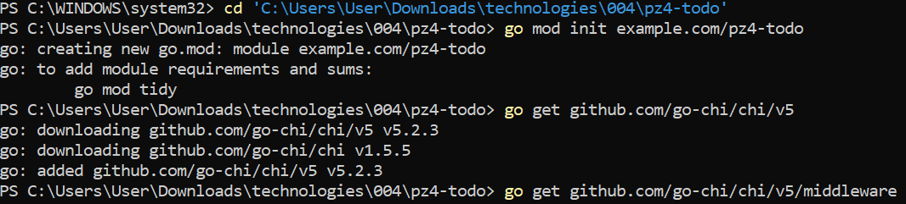

Запуск и логи проекта

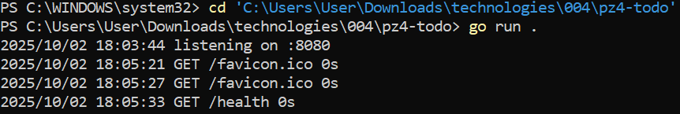

Проверка (/health)

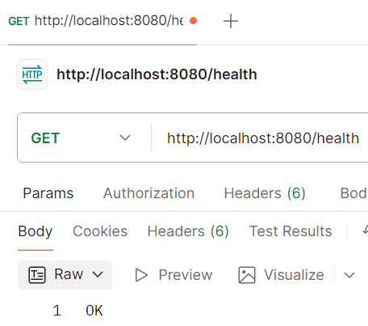

Создание задачи (/tasks -POST)

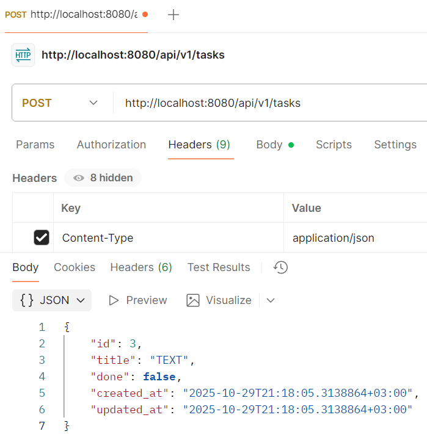

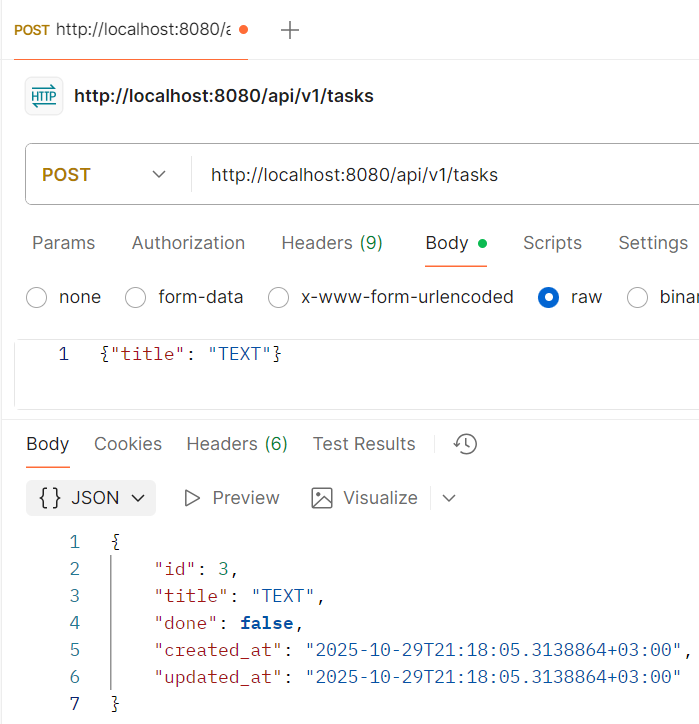

Проверка (/tasks)

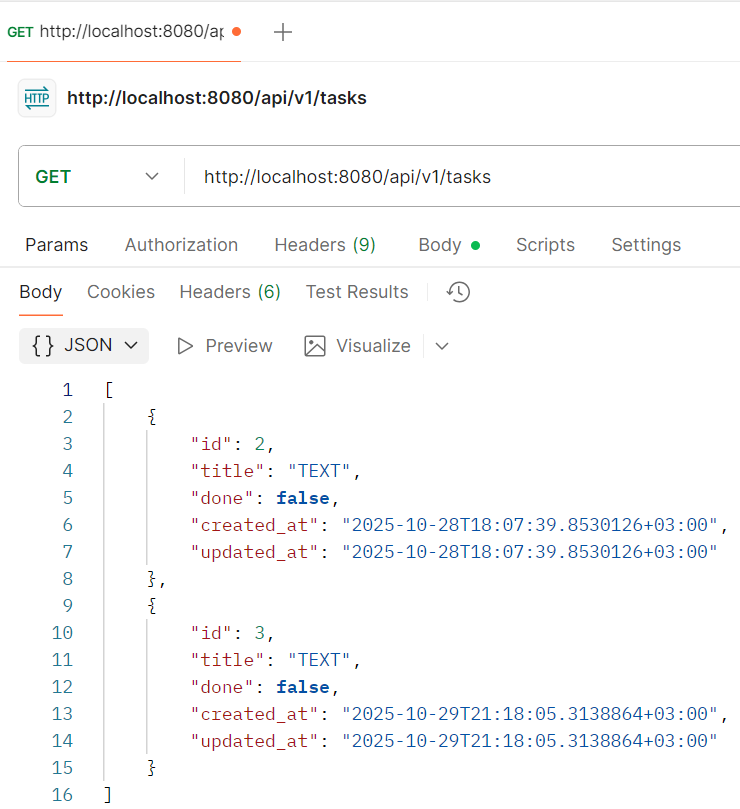

Проверка (/tasks/{id})

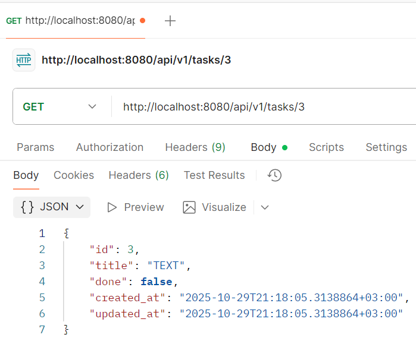

Проверка (/tasks?q=TEXT)

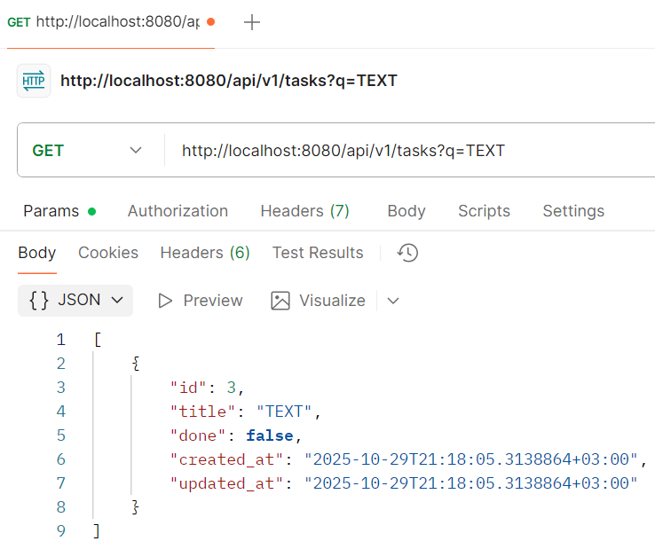

Обновление задачи (/tasks/{id} -PUT)

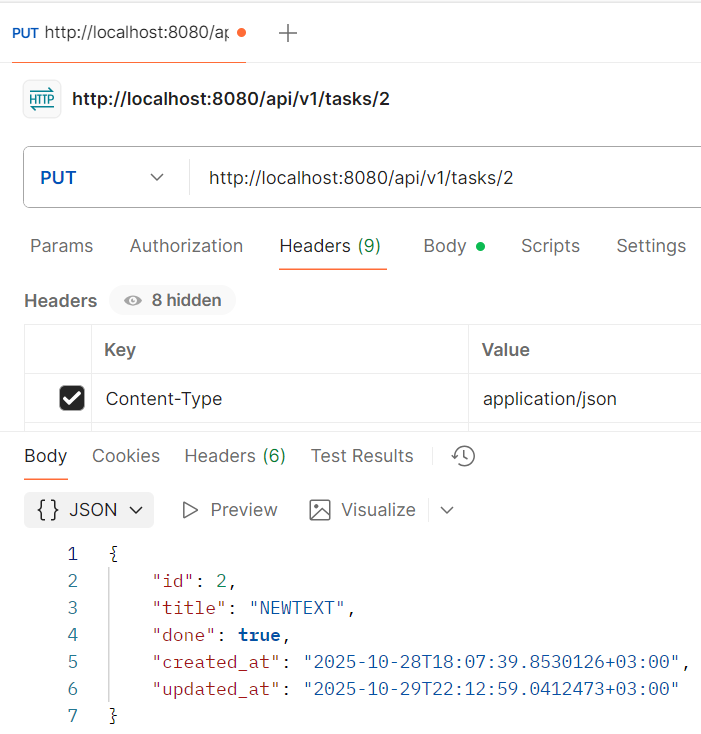

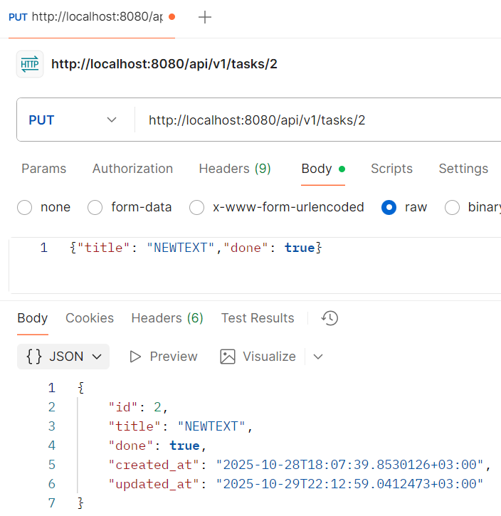

Удаление задачи (/tasks/{id} -DELETE)

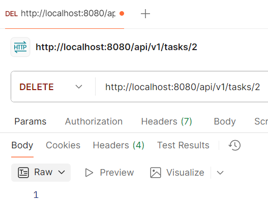

Проверка (/tasks?page=1&limit=10)

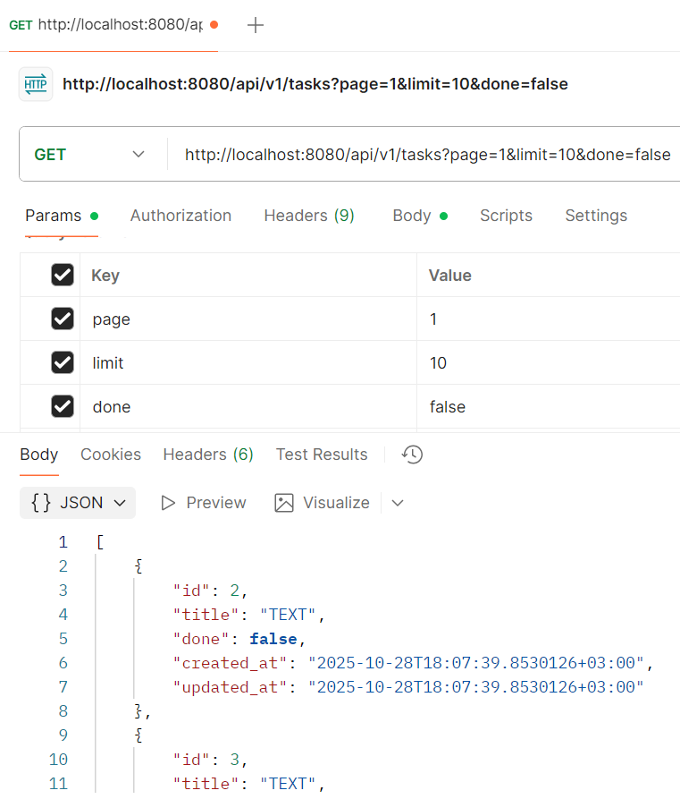

Проверки форматирования кода и базовая проверка

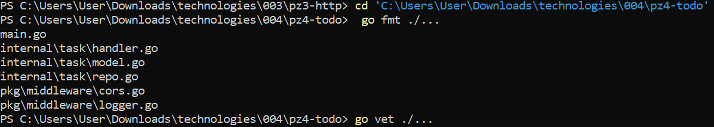

Структура проекта

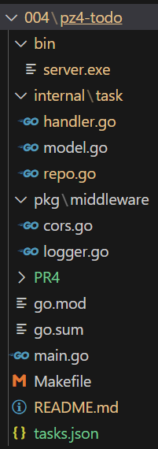