# Практическая работа №5
# Николаенко Михаил ЭФМО-02-25

## Описание проекта и требования

Для работы с командой make в PowerShell необходимо установить менеджер пакетов Chocolatey и установить команду make

Проект на языке Go (необходима версия 1.21 и выше)

Работа с задачами в БД: создание, чтение, фильтрация по статусу и получение задачи по id. Настройки пула соединений с PostgreSQL:

SetMaxOpenConns(10) — максимум 10 одновременно открытых соединений с БД. Значение подбирается по нагрузке и мощности машины, чтобы ограничить число соединений и не перегружать сервер, но при этом обеспечить параллелизм.

SetMaxIdleConns(5) — максимум 5 неактивных соединений, готовых к использованию без задержек. Обычно рекомендуется ставить меньше или равно max open connections.

SetConnMaxLifetime(30 * time.Minute) — максимальное время жизни соединения. Позволяет обновлять соединения, чтобы избежать проблем с их "старением" или потерей актуальности.

Значения подобраны умеренные для учебного проекта.

## Необходимые пароли

Подключение к серверу
логин: teacher
пароль: 1
IP: 193.233.175.221

Пользователь PostgreSQL
логин: teacher_app 
пароль: secure_password_123

## Команды запуска/сборки

### Сборка приложения:

make build

### Запуск приложения:

make run

### Запуск тоннеля подключения к серверу (в отдельной консоли):

ssh -L 5433:localhost:5432 teacher@193.233.175.221 -N -o ServerAliveInterval=30

### Остановка тоннеля подключения:

make tunnel-stop

### Проверка подключения:

make check-db

### Иснтрукция подключения:

make setup-teacher

### Показать текущие туннели:

make tunnel-status

## Структура проекта
```
/project-root
├── main.go        
├── db.go        
├── repository.go 
├── go.mod     
├── go.sum     
├── README.md     
├── .env         
├── Makefile     
└── PR5          
└── bin            
    └── server.exe
```
## Примечания по конфигурации

Подключение к PostgreSQL происходит через строку подключения из переменной окружения DATABASE_URL в файле .env

## Скриншоты работы проекта

Проверка наличия ПО

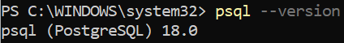

Создание БД через psql

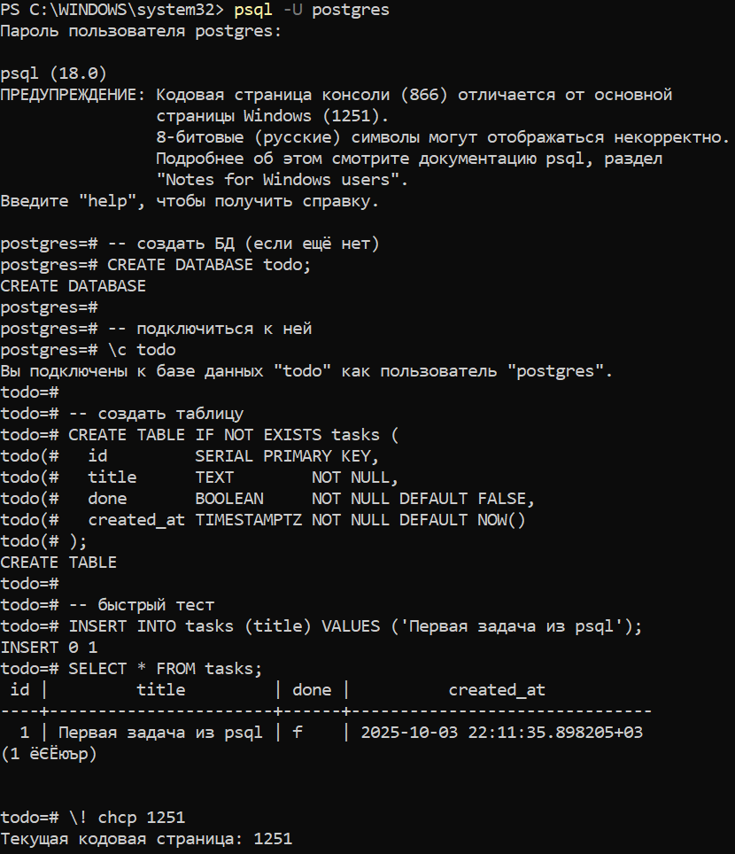

Инициализация проекта

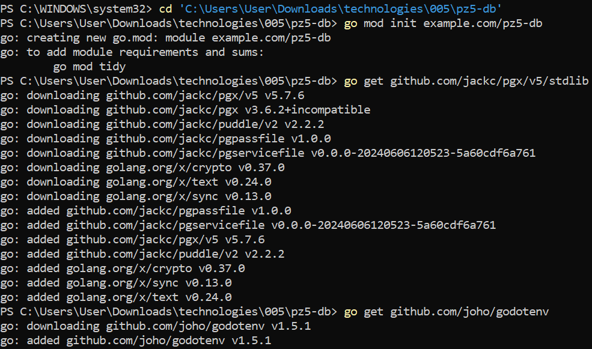

Запуск проекта

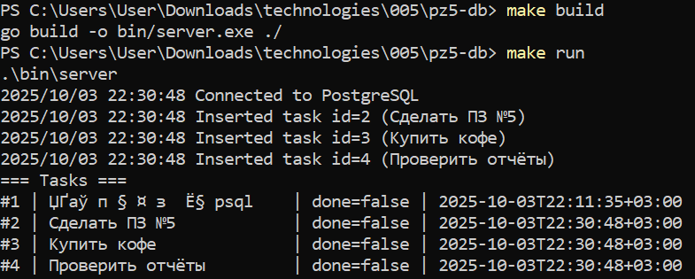

Проверка через psql

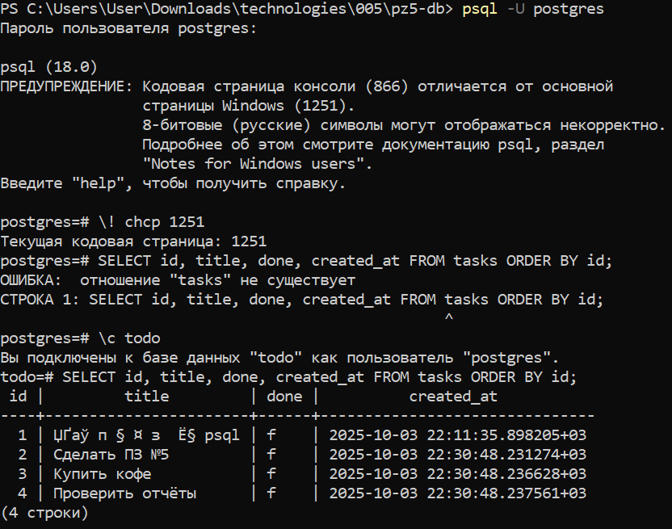

Запуск проекта после изменений

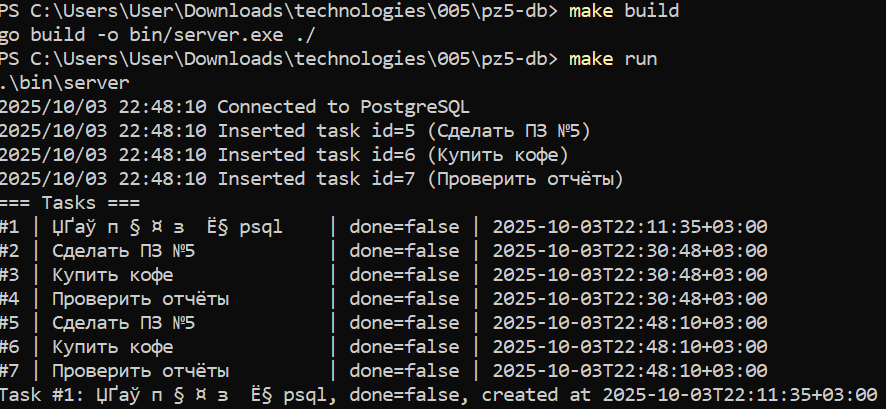

Проверка через psql

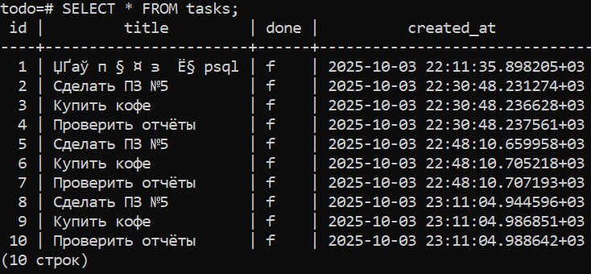

Проверки форматирования кода и базовая проверка

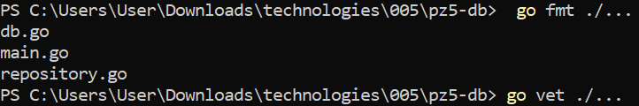

Создание пользователя на сервере

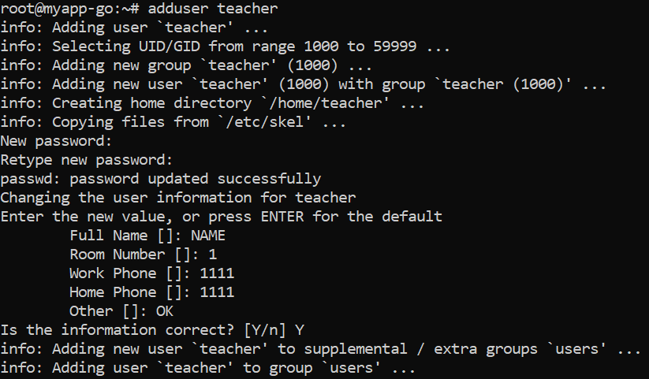

Создание пользователя БД

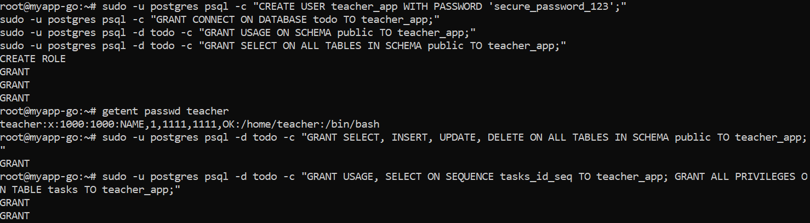

РАБОТАТЕТ!!!

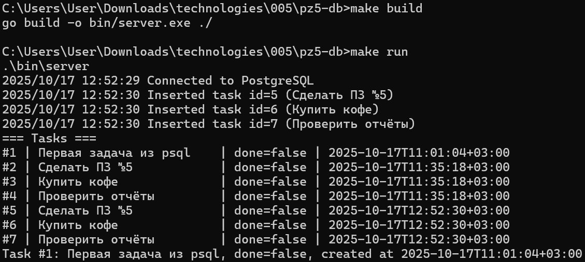

Структура проекта

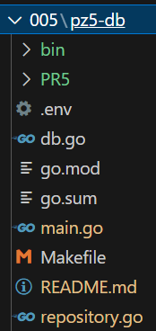