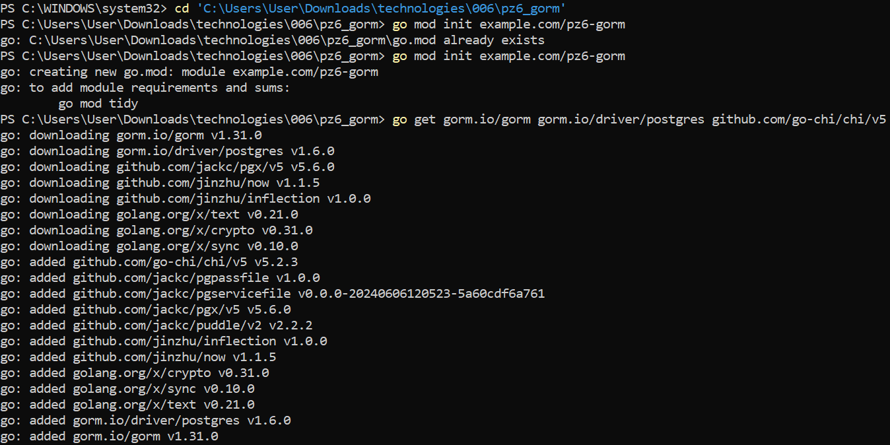
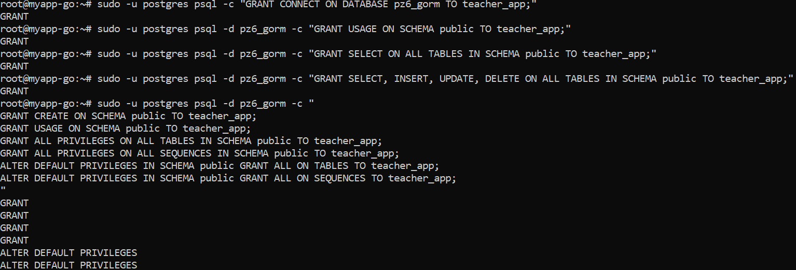
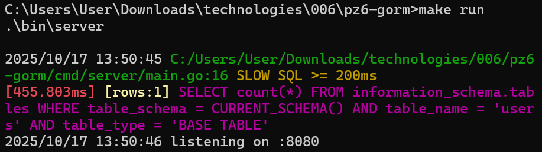
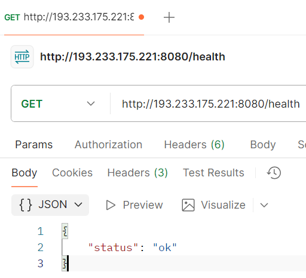
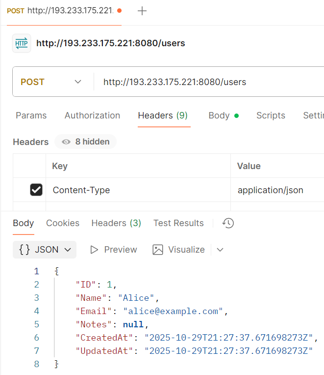
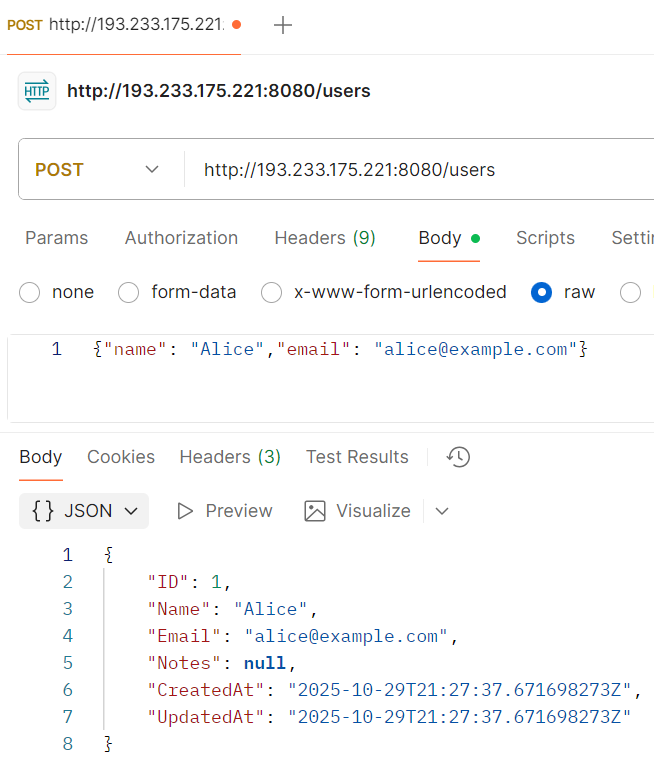
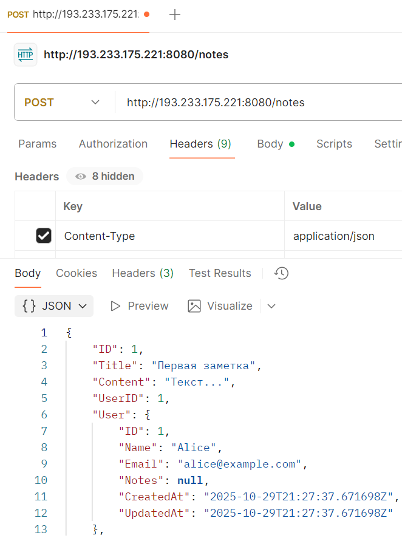
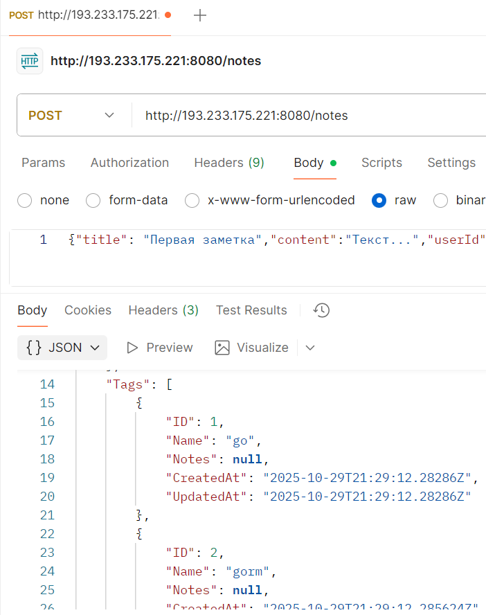
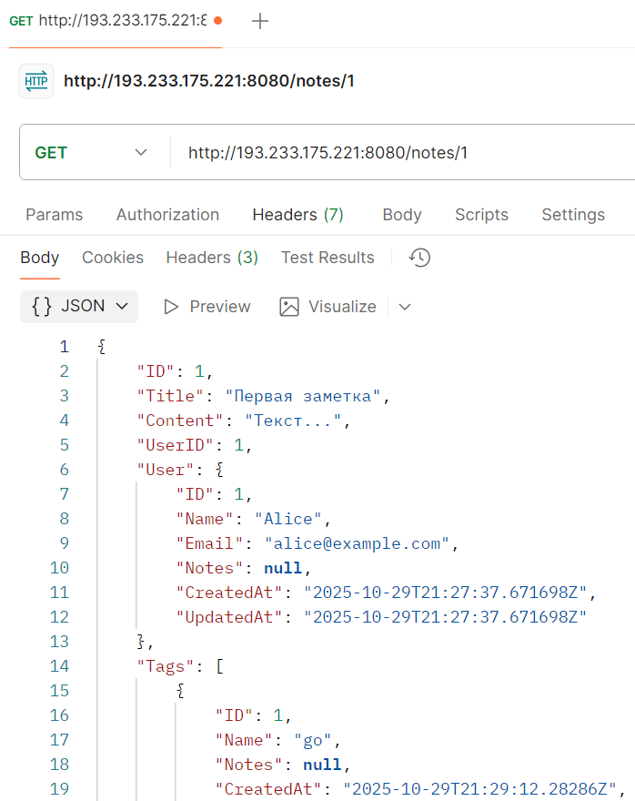
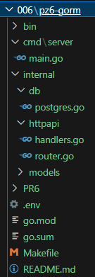

# Практическая работа №6
# Николаенко Михаил ЭФМО-02-25

## Описание проекта

GORM как ORM устраняет рутину работы с SQL, позволяя описывать модели Go-структурами с автоматической генерацией таблиц. Миграции и связи из коробки экономят время, а безопасность запросов защищает от инъекций. Идеально для быстрого старта и учебных проектов.

## Требования
- Go версии 1.25 и выше

## Основные эндпоинты
### Проверка состояния сервера
- `GET http://193.233.175.221:8080/health`

### Создание нового пользователя
- `POST http://193.233.175.221:8080/users`
  - `Headers` Key: Content-Type Value: application/json
  - `Body`: {"name": "Alice","email": "alice@example.com"}

### Создание новой заметки с тегами
- `POST http://193.233.175.221:8080/notes`
  - `Headers` Key: Content-Type Value: application/json
  - `Body`: {"title": "Первая заметка","content":"Текст...","userId": 1,"tags": ["go", "gorm"]}

### Получение заметки по ID с информацией об авторе и тегах
- `GET http://193.233.175.221:8080/notes/1`

## Команды

### проверка состояния сервера
http://193.233.175.221:8080/health

Ответ:

{"status":"ok"}

### создаём пользователя
http://193.233.175.221:8080/users

Ответ (только 1 раз):

{"ID":1,"Name":"Alice","Email":" alice@example.com","Notes":null, "CreatedAt":"2025-10-17T13:56:21.1282025+03:00","UpdatedAt":"2025-10-17T13:56:21.1282025+03:00"}

### создаём заметку с тегами
http://193.233.175.221:8080/notes

Ответ:

{"ID":1,"Title":"Первая заметка","Content":"Текст...","UserID":1,"User":{"ID":1,"Name":"Alice","Email":"alice@example.com","Notes":null,"CreatedAt":"2025-10-17T13:56:21.128202+03:00","UpdatedAt":"2025-10-17T13:56:21.128202+03:00"},"Tags":[{"ID":1,"Name":"go","Notes":null,"CreatedAt":"2025-10-17T13:57:10.133358+03:00","UpdatedAt":"2025-10-17T13:57:10.133358+03:00"},{"ID":2,"Name":"gorm","Notes":null,"CreatedAt":"2025-10-17T13:57:10.958388+03:00","UpdatedAt":"2025-10-17T13:57:10.958388+03:00"}],"CreatedAt":"2025-10-20T14:42:26.642666+03:00","UpdatedAt":"2025-10-20T14:42:26.642666+03:00"}

### получаем заметку с автором и тегами
http://193.233.175.221:8080/notes/1

Ответ:

{"ID":1,"Title":"Первая заметка","Content":"Текст...","UserID":1,"User":{"ID":1,"Name":"Alice","Email":"alice@example.com","Notes":null,"CreatedAt":"2025-10-17T13:56:21.128202+03:00","UpdatedAt":"2025-10-17T13:56:21.128202+03:00"},"Tags":[{"ID":1,"Name":"go","Notes":null,"CreatedAt":"2025-10-17T13:57:10.133358+03:00","UpdatedAt":"2025-10-17T13:57:10.133358+03:00"},{"ID":2,"Name":"gorm","Notes":null,"CreatedAt":"2025-10-17T13:57:10.958388+03:00","UpdatedAt":"2025-10-17T13:57:10.958388+03:00"}],"CreatedAt":"2025-10-20T14:42:26.642666+03:00","UpdatedAt":"2025-10-20T14:42:26.642666+03:00"}

## Структура проекта
```
.
├── bin
│   └── server.exe
├── cmd
│   └── server
│       └── main.go
├── docker-compose.yml
├── Dockerfile
├── go.mod
├── go.sum
├── internal
│   ├── db
│   │   └── postgres.go
│   ├── httpapi
│   │   ├── handlers.go
│   │   └── router.go
│   └── models
│       └── models.go
├── Makefile
├── PR6
└── README.md
```
## Примечания по конфигурации

Подключение к PostgreSQL происходит через строку подключения из переменной окружения DB_DSN в файле .env

## Скриншоты работы проекта

Инициализация проекта



Выдача прав пользователю



Запуск проекта



состояние сервера



создаём пользователя, создаём заметку с тегами, получаем заметку с автором и тегами











Структура проекта

