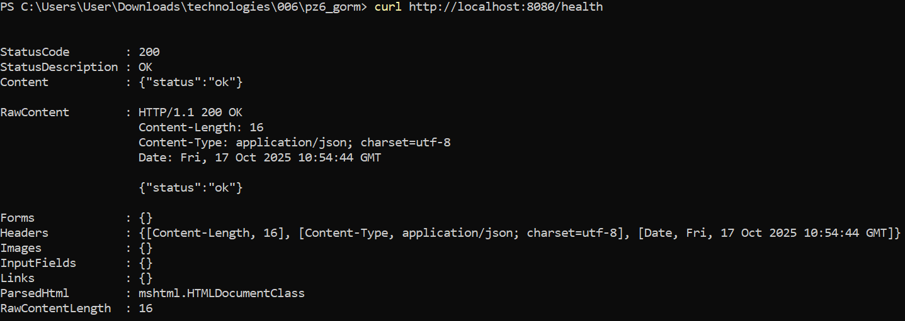
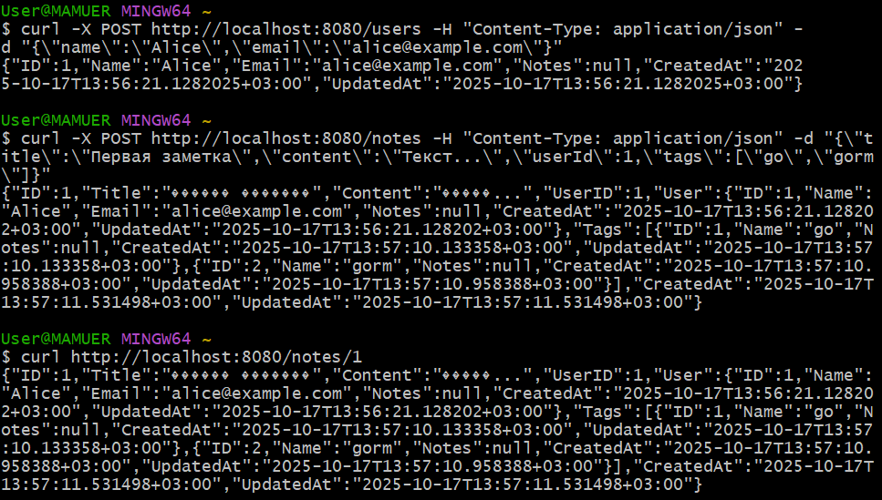

# Практическая работа №6
# Николаенко Михаил ЭФМО-02-25

## Описание проекта и требования

GORM как ORM устраняет рутину работы с SQL, позволяя описывать модели Go-структурами с автоматической генерацией таблиц. Миграции и связи из коробки экономят время, а безопасность запросов защищает от инъекций. Идеально для быстрого старта и учебных проектов.

Для работы с командой make в PowerShell необходимо установить менеджер пакетов Chocolatey и установить команду make

Проект на языке Go (необходима версия 1.21 и выше) с REST-API:

Основные эндпоинты:

- `GET http://193.233.175.221:8080/health` – проверка состояния сервера.
- `POST http://193.233.175.221:8080/users` с параметрами `Headers` Key: Content-Type Value: application/json и`Body`: {"name": "Alice","email": "alice@example.com"} – создание нового пользователя.
- `POST http://193.233.175.221:8080/notes` с параметрами `Headers` Key: Content-Type Value: application/json и`Body`: {"title": "Первая заметка","content":"Текст...","userId": 1,"tags": ["go", "gorm"]} – создание новой заметки с тегами.
- `GET http://193.233.175.221:8080/notes/1` – получение заметки по ID с информацией об авторе и тегах.

## Необходимые пароли

Подключение к серверу
- логин: teacher
- пароль: 1
- IP: 193.233.175.221

Пользователь PostgreSQL
- логин: teacher_app 
- пароль: secure_password_123

## Команды запуска/сборки

### Сборка приложения:

make build

### Запуск приложения:

make run

### Запуск тоннеля подключения к серверу (в отдельной консоли):

ssh -L 5433:localhost:5432 teacher@193.233.175.221 -N -o ServerAliveInterval=30

### Остановка тоннеля подключения:

make tunnel-stop

### Проверка подключения:

make check-db

### Иснтрукция подключения:

make setup-teacher

### Показать текущие туннели:

make tunnel-status

## Команды:

### проверка состояния сервера
http://193.233.175.221:8080/health

Ответ:

{"status":"ok"}

### создаём пользователя
http://193.233.175.221:8080/users

Ответ (только 1 раз):

{"ID":1,"Name":"Alice","Email":" alice@example.com","Notes":null, "CreatedAt":"2025-10-17T13:56:21.1282025+03:00","UpdatedAt":"2025-10-17T13:56:21.1282025+03:00"}

### создаём заметку с тегами
http://193.233.175.221:8080/notes

Ответ:

{"ID":1,"Title":"Первая заметка","Content":"Текст...","UserID":1,"User":{"ID":1,"Name":"Alice","Email":"alice@example.com","Notes":null,"CreatedAt":"2025-10-17T13:56:21.128202+03:00","UpdatedAt":"2025-10-17T13:56:21.128202+03:00"},"Tags":[{"ID":1,"Name":"go","Notes":null,"CreatedAt":"2025-10-17T13:57:10.133358+03:00","UpdatedAt":"2025-10-17T13:57:10.133358+03:00"},{"ID":2,"Name":"gorm","Notes":null,"CreatedAt":"2025-10-17T13:57:10.958388+03:00","UpdatedAt":"2025-10-17T13:57:10.958388+03:00"}],"CreatedAt":"2025-10-20T14:42:26.642666+03:00","UpdatedAt":"2025-10-20T14:42:26.642666+03:00"}

### получаем заметку с автором и тегами
http://193.233.175.221:8080/notes/1

Ответ:

{"ID":1,"Title":"Первая заметка","Content":"Текст...","UserID":1,"User":{"ID":1,"Name":"Alice","Email":"alice@example.com","Notes":null,"CreatedAt":"2025-10-17T13:56:21.128202+03:00","UpdatedAt":"2025-10-17T13:56:21.128202+03:00"},"Tags":[{"ID":1,"Name":"go","Notes":null,"CreatedAt":"2025-10-17T13:57:10.133358+03:00","UpdatedAt":"2025-10-17T13:57:10.133358+03:00"},{"ID":2,"Name":"gorm","Notes":null,"CreatedAt":"2025-10-17T13:57:10.958388+03:00","UpdatedAt":"2025-10-17T13:57:10.958388+03:00"}],"CreatedAt":"2025-10-20T14:42:26.642666+03:00","UpdatedAt":"2025-10-20T14:42:26.642666+03:00"}

## Структура проекта
```
C:.
└───pz6-gorm
    ├───.env
    ├───go.mod
    ├───go.sum
    ├───Makefile
    ├───README.md
    │
    ├───bin
    │   └───server.exe
    │
    ├───cmd
    │   └───server
    │       └───main.go
    │
    ├───internal
    │   ├───db
    │   │   └───postgres.go
    │   │
    │   ├───httpapi
    │   │   ├───handlers.go
    │   │   └───router.go
    │   │
    │   └───models
    │       └───models.go
    │
    └───PR6
```
## Примечания по конфигурации

Подключение к PostgreSQL происходит через строку подключения из переменной окружения DB_DSN в файле .env

## Скриншоты работы проекта

Инициализация проекта


Выдача прав пользователю


Запуск проекта


здоровье



создаём пользователя, создаём заметку с тегами, получаем заметку с автором и тегами



Структура проекта

