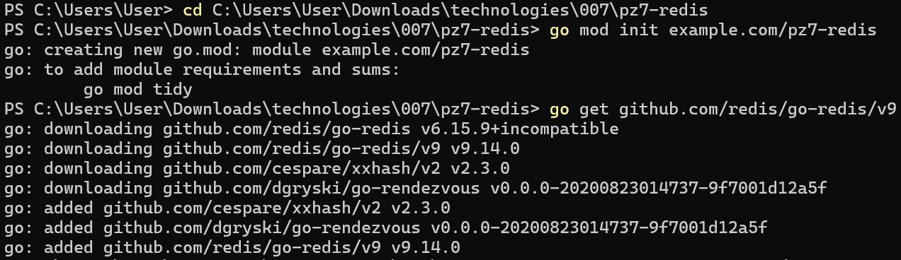
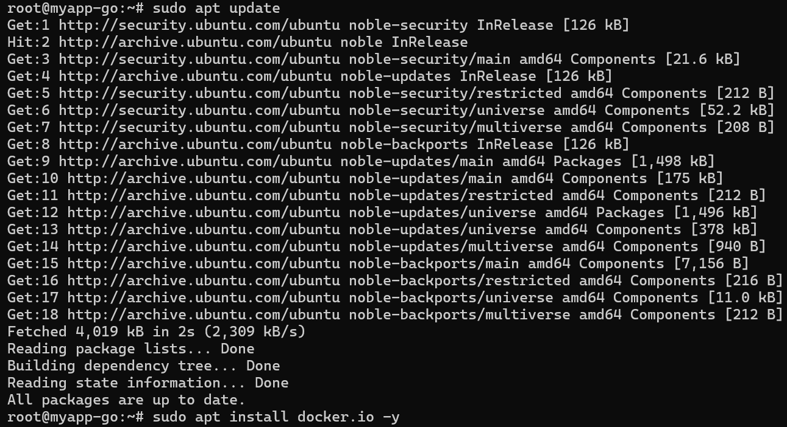
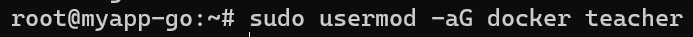
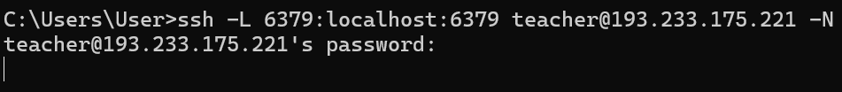
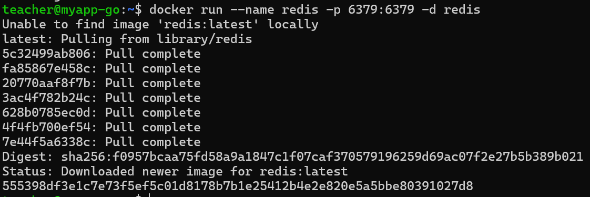
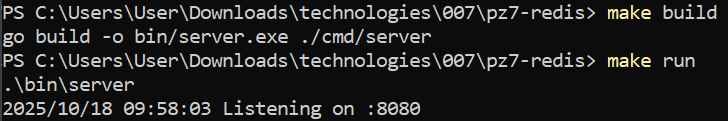
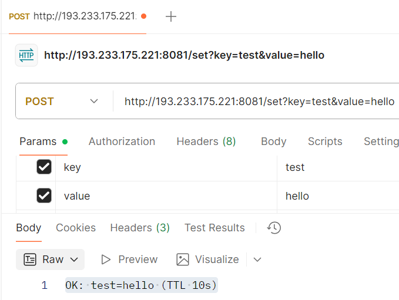
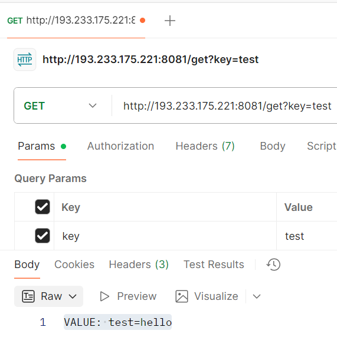
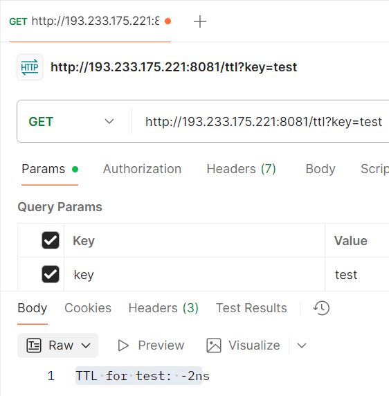
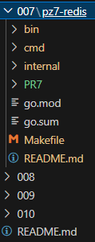

# Практическая работа №7
# Николаенко Михаил ЭФМО-02-25

## Описание проекта

Redis — быстрая in-memory БД для хранения временных данных. TTL автоматически удаляет данные по истечении срока их жизни, экономя память и поддерживая актуальность информации.

### Требования
- Go версии 1.25 и выше

## Основные эндпоинты
### Установка значения по ключу
- `POST http://193.233.175.221:8081/set?key=test&value=hello`

### Получение значения по ключу
- `GET http://193.233.175.221:8081/get?key=test`

### Проверка TTL (времени жизни) ключа
- `GET http://193.233.175.221:8081/ttl?key=test`

## Команды

### установка значения
http://localhost:8081/set?key=test&value=hello

Ответ:

OK: test=hello (TTL 10s)

### получение значения
http://localhost:8081/get?key=test

Ответ:

VALUE: test=hello

### проверка TTL
http://localhost:8081/ttl?key=test

Ответ:

TTL for test: -2ns

## Структура проекта
```
C:.
└───pz7-redis
    ├───go.mod
    ├───go.sum
    ├───Makefile
    ├───README.md
    │
    ├───bin
    │   └───server.exe
    │
    ├───cmd
    │   └───server
    │       └───main.go
    │
    ├───internal
    │   └───cache
    │       └───cache.go
    │
    └───PR7
```
## Скриншоты работы проекта

Инициализация проекта



Установка Docker на сервер



Выдача прав пользователю



Запуск SSH тоннеля



Запуск Redis



Запуск проекта



Установка значения



Получение значения



Проверка TTL



Структура проекта

