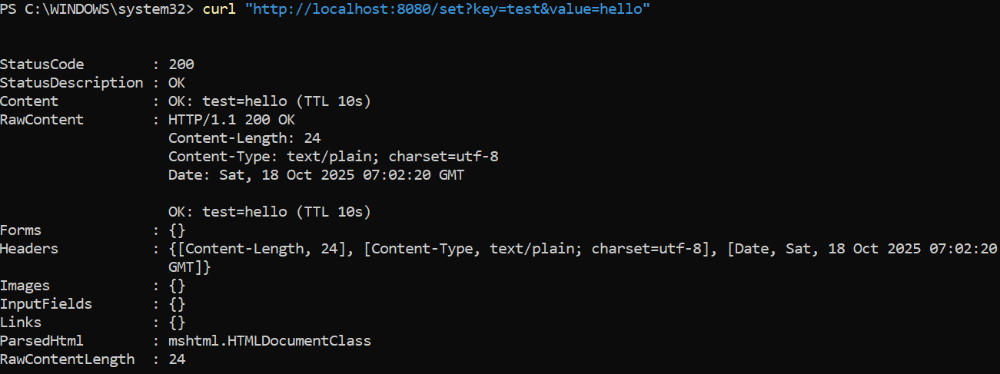
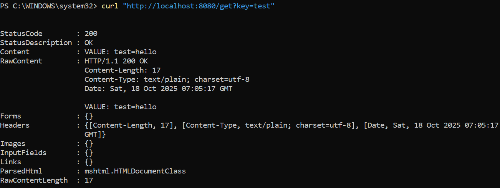
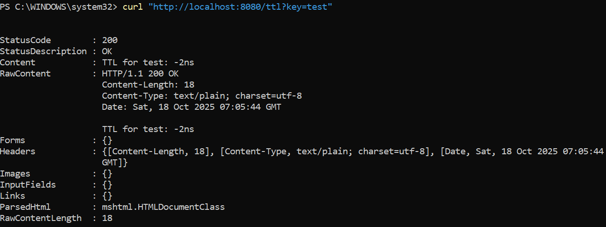

# Практическая работа №7
# Николаенко Михаил ЭФМО-02-25

## Описание проекта и требования

Redis — быстрая in-memory БД для хранения временных данных. TTL автоматически удаляет данные по истечении срока их жизни, экономя память и поддерживая актуальность информации.

### Требования
- Go версии 1.25 и выше

## Основные эндпоинты

- `GET http://193.233.175.221:8080/set?key=test&value=hello` – установка значения по ключу.
- `GET http://193.233.175.221:8080/get?key=test` – получение значения по ключу.
- `GET http://193.233.175.221:8080/ttl?key=test` – проверка TTL (времени жизни) ключа.

## Команды запуска/сборки

### Сборка приложения:

make build

### Запуск приложения:

make run

### Остановка тоннеля подключения:

make tunnel-stop

### Иснтрукция подключения:

make setup-teacher

### Показать текущие туннели:

make tunnel-status

## Команды:

### установка значения
http://localhost:8080/set?key=test&value=hello

Ответ:

OK: test=hello (TTL 10s)

### получение значения
http://localhost:8080/get?key=test

Ответ:

VALUE: test=hello

### проверка TTL
http://localhost:8080/ttl?key=test

Ответ:

TTL for test: -2ns

## Структура проекта
```
C:.
└───pz7-redis
    ├───go.mod
    ├───go.sum
    ├───Makefile
    ├───README.md
    │
    ├───bin
    │   └───server.exe
    │
    ├───cmd
    │   └───server
    │       └───main.go
    │
    ├───internal
    │   └───cache
    │       └───cache.go
    │
    └───PR7
```
## Скриншоты работы проекта

Инициализация проекта


Установка Docker на сервер


Выдача прав пользователю


Запуск SSH тоннеля


Запуск Redis


Запуск проекта


Установка значения



Получение значения



Проверка TTL



Структура проекта

