# Практическая работа №8
# Николаенко Михаил ЭФМО-02-21

## Описание проекта

MongoDB как документная NoSQL-база предоставляет гибкость хранения JSON-подобных документов без жесткой схемы. Официальный драйвер для Go позволяет выполнять CRUD-операции, текстовый поиск и агрегации. Идеально для проектов с изменяющейся структурой данных и быстрым прототипированием.

## Требования
- Go версии 1.25 и выше

## Основные эндпоинты
### Базовая проверка состояния сервиса
- `GET http://193.233.175.221:8082/health`

### Создание новой заметки
- `POST http://193.233.175.221:8082/api/v1/notes`
  - `Headers` Key: Content-Type Value: application/json
  - `Body`: {"title": "TEXT"}

### Получение списка заметок с пагинацией
- `GET http://193.233.175.221:8082/api/v1/notes?limit=5&skip=0`

### Получение списка всех заметок
- `GET http://193.233.175.221:8082/api/v1/notes`

### Получение конкретной заметки по ID
- `GET http://193.233.175.221:8082/api/v1/notes/<id>`

### Изменение текста заметки
- `PATCH http://193.233.175.221:8082/api/v1/notes/<id>`
  - `Headers` Key: Content-Type Value: application/json
  - `Body`: {"title": "NEWTEXT","content": "BLAH"}

### Поиск заметок по заголовку (regex)
- `GET http://193.233.175.221:8082/api/v1/notes?q=TEXT&limit=5`

### Полнотекстовый поиск по содержимому
- `GET http://193.233.175.221:8082/api/v1/notes/search/text?q=BLAH&limit=10`

### Общая статистика по заметкам
- `GET http://193.233.175.221:8082/api/v1/notes/stats`

### Статистика по дням
- `GET http://193.233.175.221:8082/api/v1/notes/stats/daily?days=7`

### Удаление заметки
- `DELETE http://193.233.175.221:8082/api/v1/notes/<id>`

## Команды:

### Базовая проверка состояния сервиса
http://193.233.175.221:8082/health

Ответ:

{"status":"ok"}

### Создание заметки:
http://193.233.175.221:8082/api/v1/notes

Ответ:

{"id":"68f62982646a61dc68d7c292","title":"Первая заметка","content":"Текст заметки...","createdAt":"2025-10-20T15:22:26.7451612+03:00","updatedAt":"2025-10-20T15:22:26.7451612+03:00"}

### Получение списка заметок:
#### простой список
http://193.233.175.221:8082/api/v1/notes?limit=5&skip=0

Ответ:

{"notes":[{"id":"68f62982646a61dc68d7c292","title":"Первая заметка","content":"Текст заметки...","createdAt":"2025-10-20T12:22:26.745Z","updatedAt":"2025-10-20T12:22:26.745Z","score":1},{"id":"68f4fe160b08ca63d9be709e","title":"Remote note","content":"Working with remote MongoDB!","createdAt":"2025-10-19T15:04:54.171Z","updatedAt":"2025-10-19T15:04:54.171Z","score":1}],"query":"","searchType":""}

#### поиск по заголовку (regex)
http://193.233.175.221:8082/api/v1/notes?q=заметка&limit=5

Ответ:

{"notes":[{"id":"68f62982646a61dc68d7c292","title":"Первая заметка","content":"Текст заметки...","createdAt":"2025-10-20T12:22:26.745Z","updatedAt":"2025-10-20T12:22:26.745Z","score":1}],"query":"заметка","searchType":""}

#### полнотекстовый поиск
http://193.233.175.221:8082/api/v1/notes/search/text?q=программирование&limit=10

Ответ:

{"notes":null,"query":"программирование","total":0}

### Получение заметки по ID:
http://193.233.175.221:8082/api/v1/notes/<object_id_here>

Ответ:

{"id":"68f62982646a61dc68d7c292","title":"Первая заметка","content":"Текст заметки...","createdAt":"2025-10-20T12:22:26.745Z","updatedAt":"2025-10-20T12:22:26.745Z"}

### Частичное обновление заметки:
http://193.233.175.221:8082/api/v1/notes/68f62982646a61dc68d7c292

Ответ:

{"id":"68f62982646a61dc68d7c292","title":"Первая заметка","content":"Обновленный текст","createdAt":"2025-10-20T12:22:26.745Z","updatedAt":"2025-10-20T12:25:51.365Z"}

### Удаление заметки:
http://193.233.175.221:8082/api/v1/notes/<object_id_here>

### Общая статистика:
http://193.233.175.221:8082/api/v1/notes/stats

Ответ:

{"totalNotes":1,"avgContentLength":28,"maxContentLength":28,"minContentLength":28}

### Статистика по дням:
http://193.233.175.221:8082/api/v1/notes/stats/daily?days=7

Ответ:

{"period":7,"stats":[{"date":"2025-10-19","count":1}]}

## Структура проекта
```
C:.
└───pz8-mongo
    ├───.env.example
    ├───go.mod
    ├───go.sum
    ├───Makefile
    ├───README.md
    │
    ├───bin
    │   └───server.exe
    │
    ├───cmd
    │   └───api
    │       └───main.go
    │
    ├───internal
    │   ├───db
    │   │   └───mongo.go
    │   │
    │   └───notes
    │       ├───handler.go
    │       ├───model.go
    │       ├───repo.go
    │       └───repo_test.go
    │
    └───PR8
```
## Примечания по конфигурации

Подключение к MongoDB происходит через файл .env.example

## Скриншоты работы проекта

Инициализация проекта


Создание конфигурационного файла MongoDB на сервере

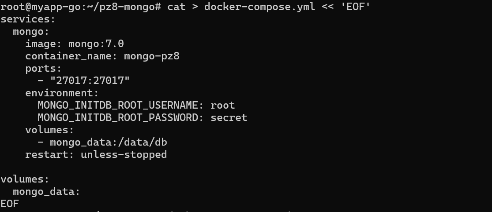

Установка Docker на сервере

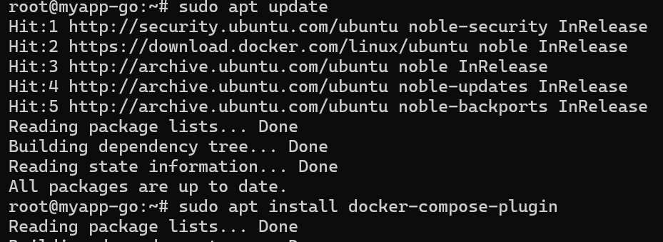

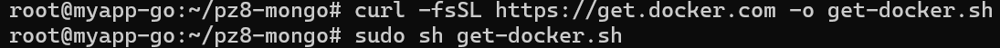

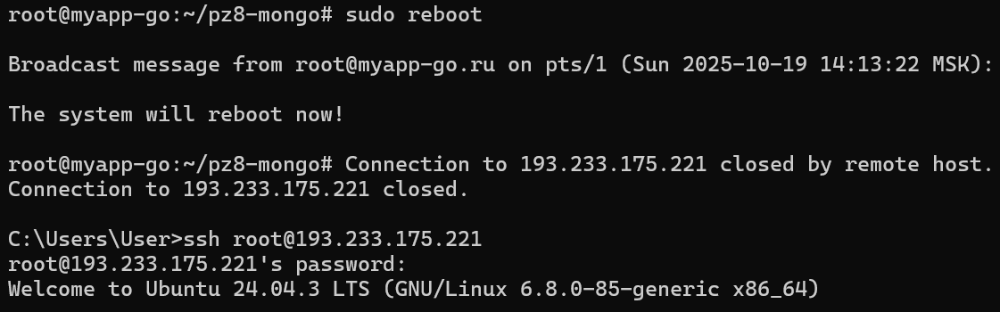

Запуск MongoDB на сервере

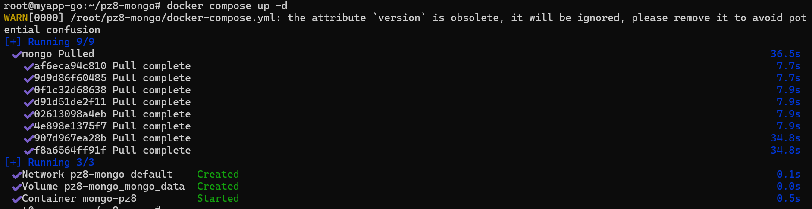

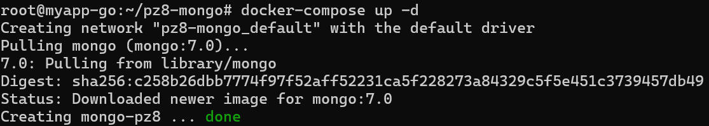

Проверка работы MongoDB

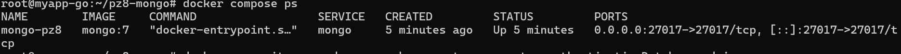

Создание пользователя для MongoDB

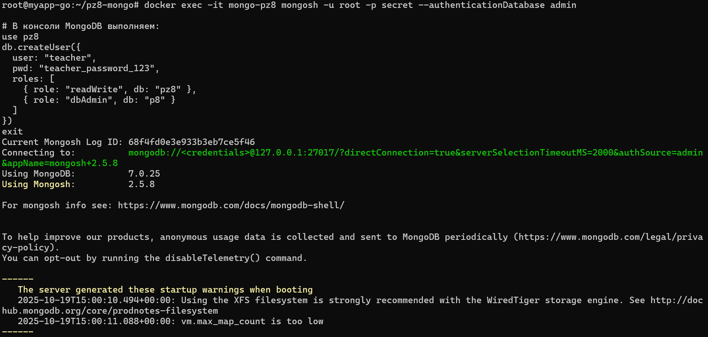

Подключение к серверу по SSH тоннелю

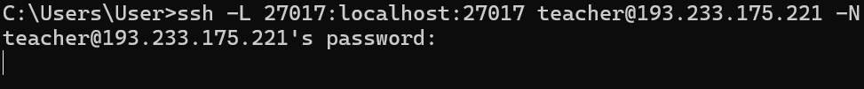

Проверка и запуск локального приложения

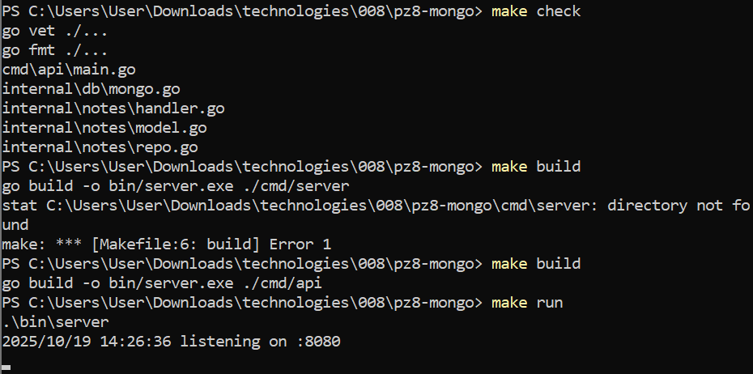

Базовая проверка состояния сервера

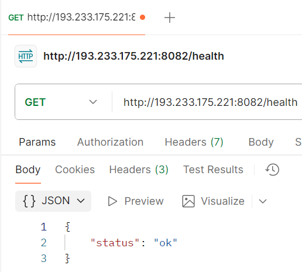

Создание заметки, простой список заметок, поиск заметок по заголовку (regex), полнотекстовый поиск заметок, получение заметки по ID, частичное обновление заметки, удаление заметки, общая статистика, статистика по дням:

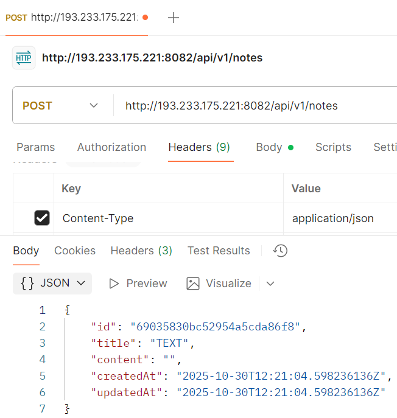

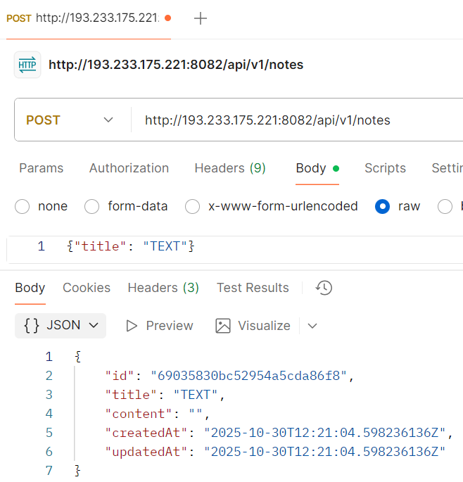

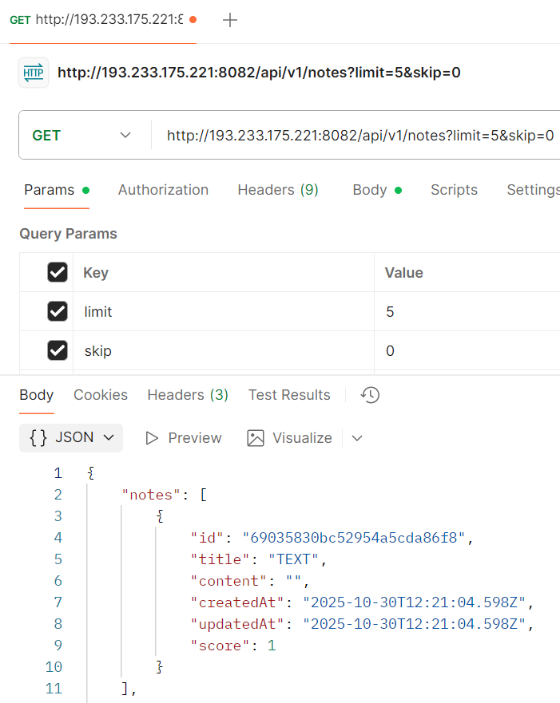

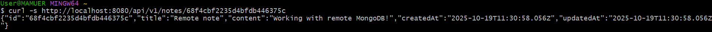

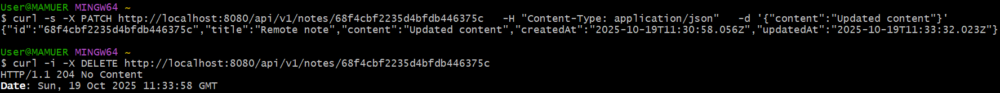

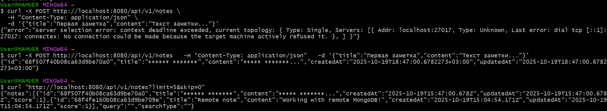

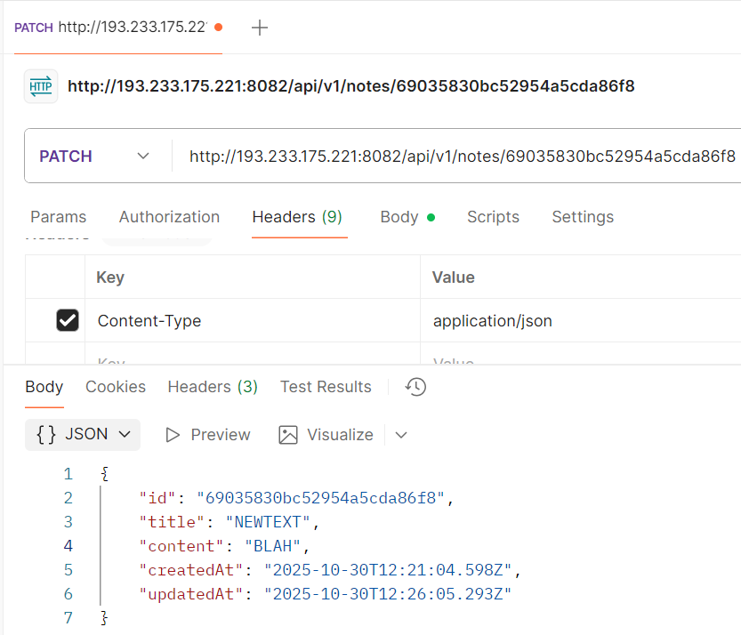

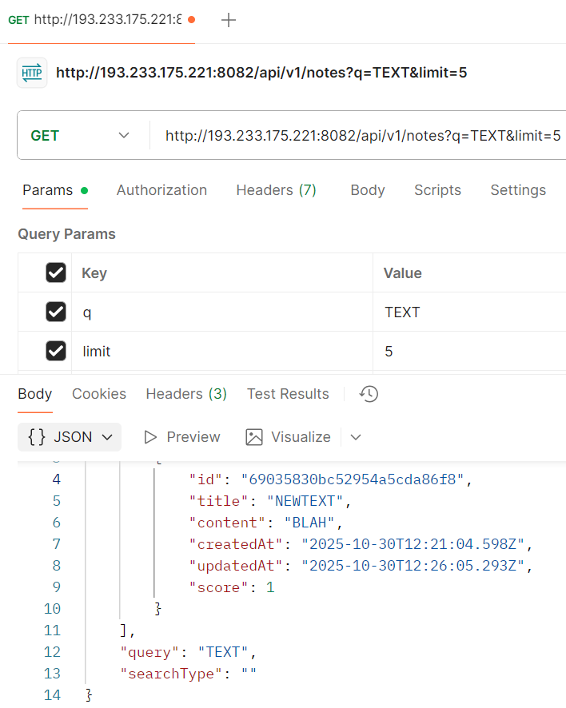

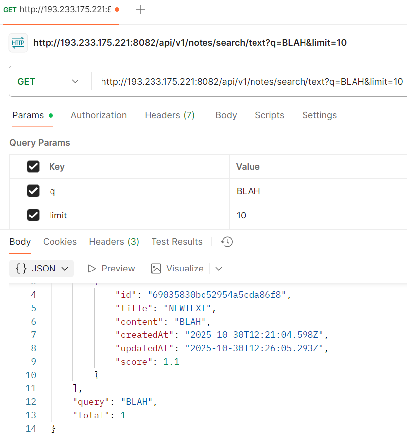

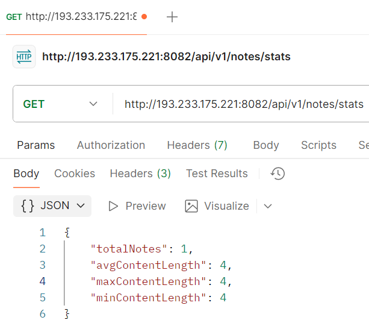

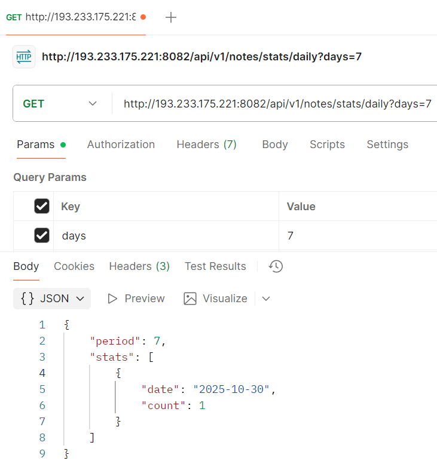

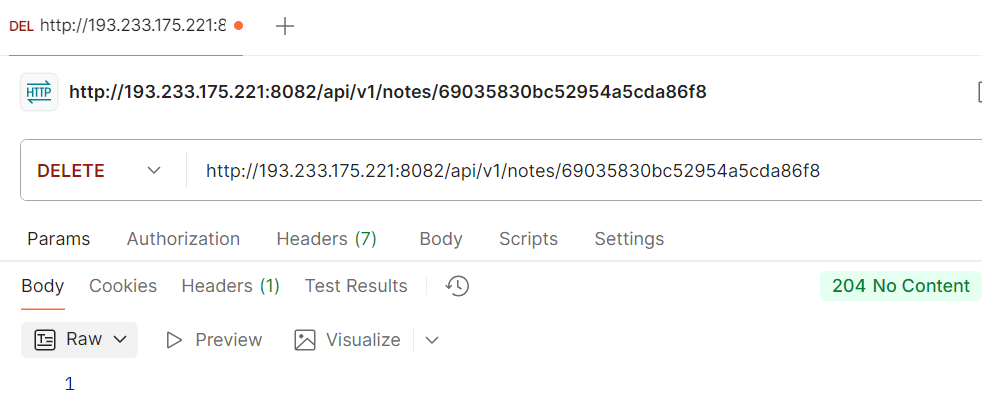

Тест

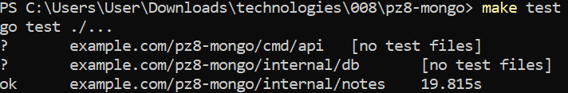

Структура проекта

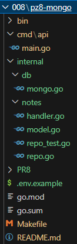