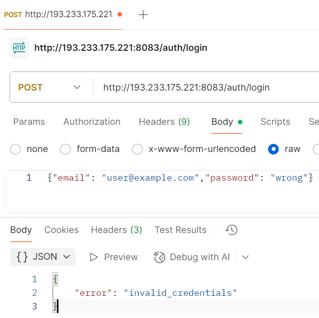

# Практическая работа №9
# Николаенко Михаил ЭФМО-02-21

## Описание проекта

Данный сервис предоставляет REST API для регистрации и аутентификации пользователей с безопасным хранением паролей using bcrypt хэшированием. Реализованы эндпоинты для создания учетных записей и входа в систему с валидацией входных данных и защитой от утечки информации.

### Требования
- Go версии 1.25 и выше

## Основные эндпоинты
### Регистрация пользователя
- `POST http://193.233.175.221:8083/auth/register`
  - `Headers` Key: Content-Type Value: application/json
  - `Body`: {"email": "user@example.com","password": "Secret123!"}
  - *Примечание: для проверки ошибки измените пароль на {"email": "user@example.com","password": "AnotherPass!"}*

### Аутентификация пользователя
- `POST http://193.233.175.221:8083/auth/login`
  - `Headers` Key: Content-Type Value: application/json
  - `Body`: {"email": "user@example.com","password": "Secret123!"}
  - *Примечание: для проверки ошибки измените пароль на {"email": "user@example.com","password": "wrong"}*

## Команды:

### Базовая и повторная регистрации
http://193.233.175.221:8083/auth/register

Ответы:

{"status":"ok","user":{"id":1,"email":"user@example.com"}}

{"error":"email_taken"}

### Успешная и неуспешная аутентификации:
http://193.233.175.221:8083/auth/login

Ответы:

{"status":"ok","user":{"id":1,"email":"user@example.com"}}

{"error":"invalid_credentials"}

## Структура проекта
```
C:.
├───.env
├───go.mod
├───go.sum
├───Makefile
├───README.md
│
├───bin
│   └───server.exe
│
├───cmd
│   └───api
│       └───main.go
│
├───internal
│   ├───core
│   │       user.go
│   │
│   ├───http
│   │   └───handlers
│   │       └───auth.go
│   │
│   ├───platform
│   │   └───config
│   │       └───config.go
│   │
│   └───repo
│       ├───postgres.go
│       └───user_repo.go
│
└───PR9
```
## Примечания по конфигурации

Подключение к PostgreSQL происходит через файл .env

## Скриншоты работы проекта

Инициализация проекта


Настройка прав пользователя


Подключение к серверу по SSH тоннелю


Проверка и запуск локального приложения


Удачная и неудачная регистрации, удачный и неудачный логин:




Структура проекта

