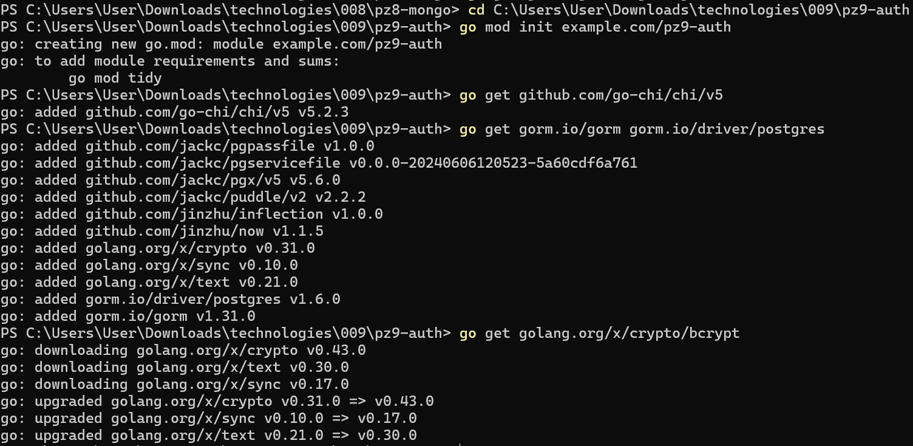
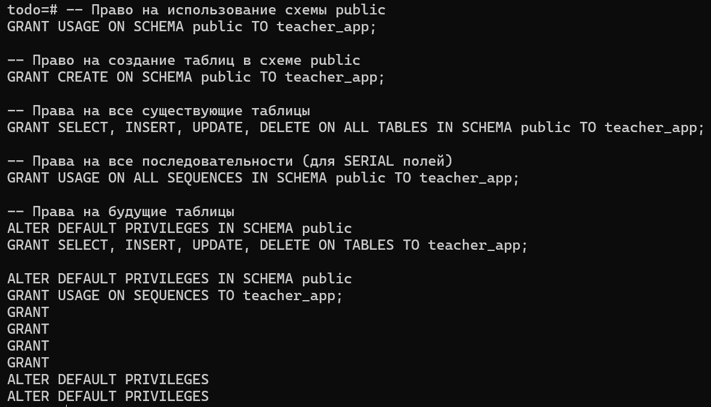
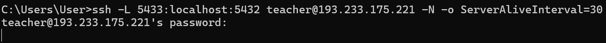
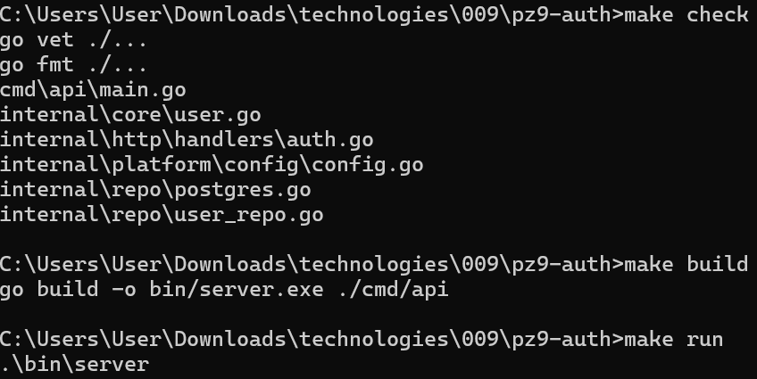
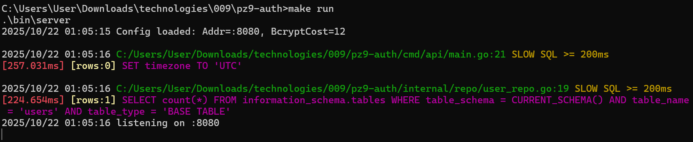
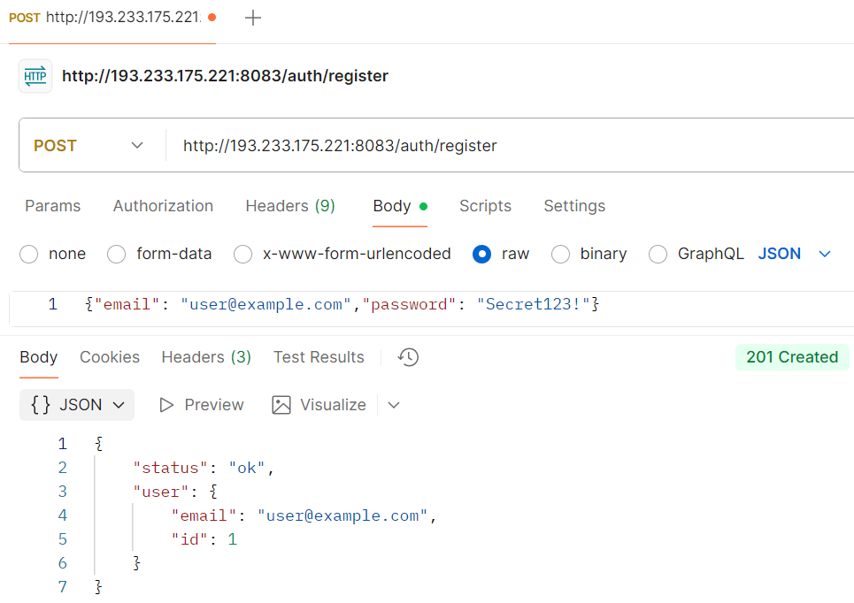
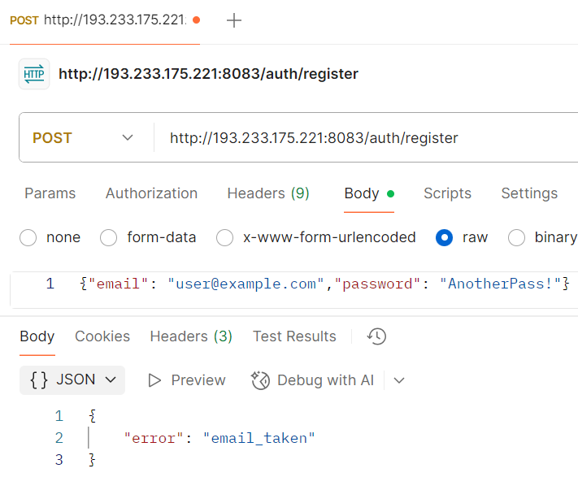
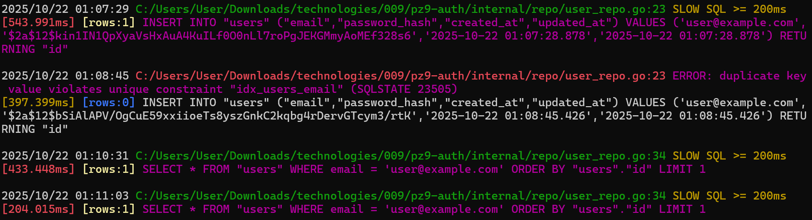
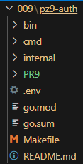

# Практическая работа №8
# Николаенко Михаил ЭФМО-02-21

## Описание проекта и требования

Данный сервис предоставляет REST API для регистрации и аутентификации пользователей с безопасным хранением паролей using bcrypt хэшированием. Реализованы эндпоинты для создания учетных записей и входа в систему с валидацией входных данных и защитой от утечки информации.

Для работы с командой make в PowerShell необходимо установить менеджер пакетов Chocolatey и установить команду make

Проект на языке Go (необходима версия 1.21 и выше) с REST-API:

Основные эндпоинты:

- `POST /auth/register` – регистрация пользователя с валидацией email и пароля
- `POST /auth/login` – аутентификация пользователя с проверкой учетных данных

## Необходимые пароли

Подключение к серверу
- логин: teacher
- пароль: 1
- IP: 193.233.175.221

Пользователь PostgreSQL
- логин: teacher_app 
- пароль: secure_password_123
- порт: 5432

## Команды запуска/сборки

### Запуск тоннеля подключения к серверу (в отдельной консоли):

ssh -L 5433:localhost:5432 teacher@193.233.175.221 -N -o ServerAliveInterval=30

### Сборка приложения:

make build

### Запуск приложения:

make run

### Остановка тоннеля подключения:

make tunnel-stop

### Иснтрукция подключения:

make setup-teacher

### Показать текущие туннели:

make tunnel-status

## Команды:

### Базовая и повторная регистрации
curl -X POST http://localhost:8080/auth/register ^
  -H "Content-Type: application/json" ^
  -d "{\"email\":\"user@example.com\",\"password\":\"Secret123!\"}"

curl -X POST http://localhost:8080/auth/register ^
  -H "Content-Type: application/json" ^
  -d "{\"email\":\"user@example.com\",\"password\":\"AnotherPass\"}"

Ответы:

{"status":"ok","user":{"id":1,"email":"user@example.com"}}

{"error":"email_taken"}

### Успешная и неуспешная аутентификации:
curl -X POST http://localhost:8080/auth/login ^
  -H "Content-Type: application/json" ^
  -d "{\"email\":\"user@example.com\",\"password\":\"Secret123!\"}"

curl -X POST http://localhost:8080/auth/login ^
  -H "Content-Type: application/json" ^
  -d "{\"email\":\"user@example.com\",\"password\":\"wrong\"}"

Ответы:

{"status":"ok","user":{"id":1,"email":"user@example.com"}}

{"error":"invalid_credentials"}

## Структура проекта
```
C:.
├───.env
├───go.mod
├───go.sum
├───Makefile
├───README.md
│
├───bin
│   └───server.exe
│
├───cmd
│   └───api
│       └───main.go
│
├───internal
│   ├───core
│   │       user.go
│   │
│   ├───http
│   │   └───handlers
│   │       └───auth.go
│   │
│   ├───platform
│   │   └───config
│   │       └───config.go
│   │
│   └───repo
│       ├───postgres.go
│       └───user_repo.go
│
└───PR9
```
## Примечания по конфигурации

Подключение к PostgreSQL происходит через файл .env

## Скриншоты работы проекта

Инициализация проекта



Настройка прав пользователя



Подключение к серверу по SSH тоннелю



Проверка и запуск локального приложения





Удачная и неудачная регистрации, удачный и неудачный логин:







Структура проекта

