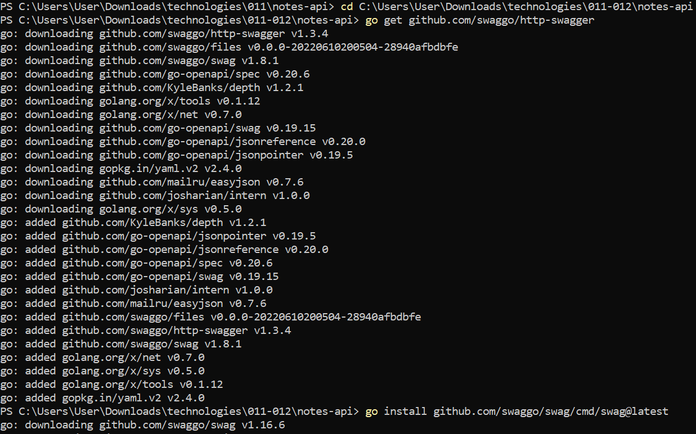
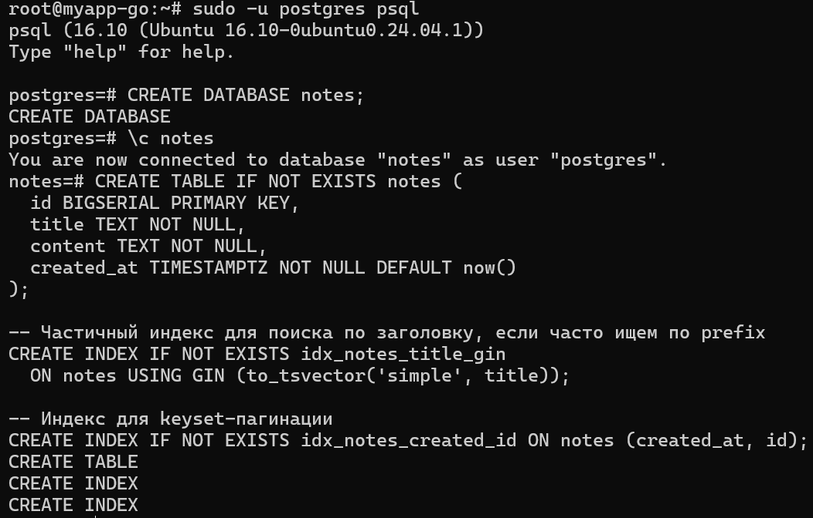
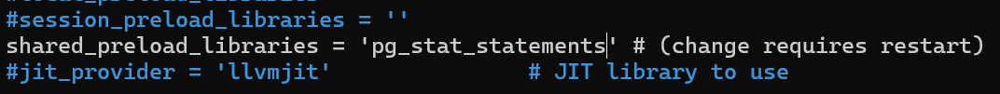
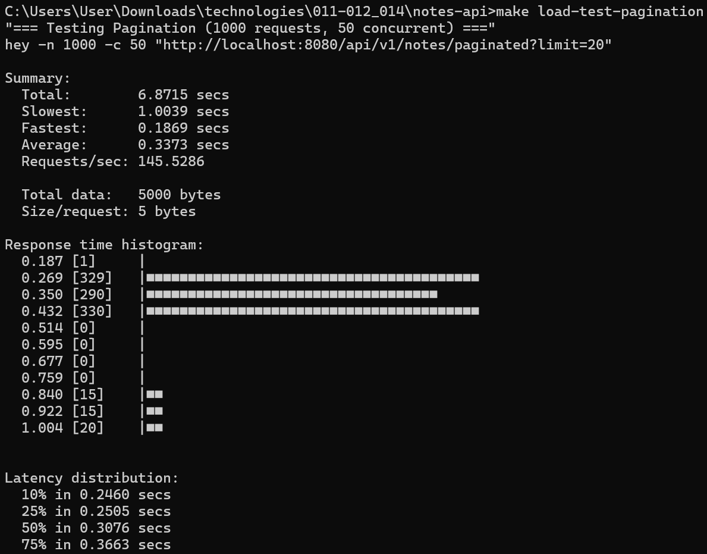
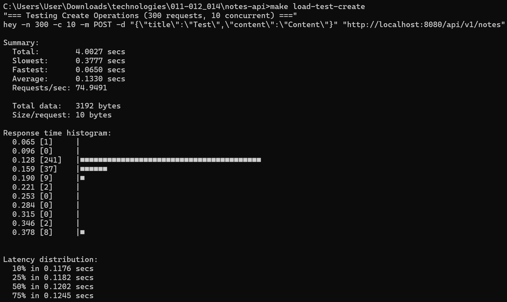
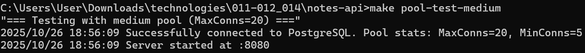
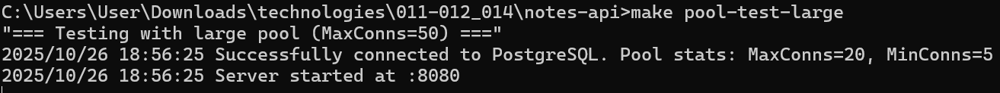
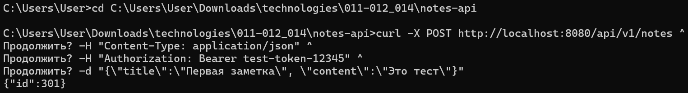
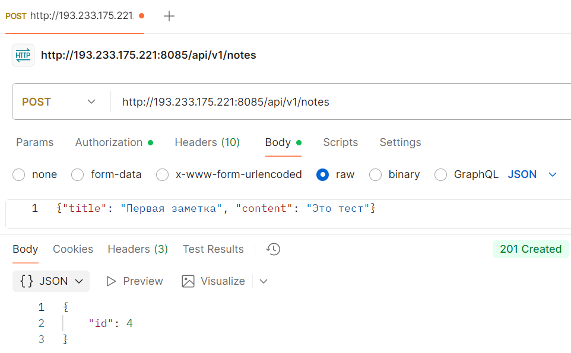
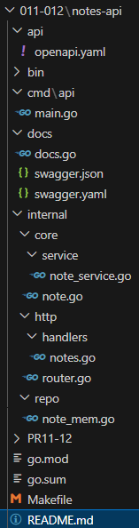

# Практическая работа №11-12, 14
# Николаенко Михаил ЭФМО-02-21

## Описание проекта и требования

Освоение принципов проектирования REST API и слоистой архитектуры через реализацию CRUD-интерфейса для системы заметок с использованием code-first подхода, при котором кодовая база предшествует формальному описанию API.

### Требования
- Go версии 1.25 и выше

## Основные эндпоинты
### Создание заметки
- `POST http://193.233.175.221:8085/api/v1/notes`
  - `Headers` Key: Content-Type Value: application/json
  - `Headers` Key: Authorization Value: Bearer {token}
  - `Body`: {"title": "Первая заметка", "content": "Это тест"}

### Получение списка заметок с пагинацией и поиском
- `GET http://193.233.175.221:8085/api/v1/notes?page=1&limit=10&q=заметка`
  - `Headers` Key: Authorization Value: Bearer {token}
  - `Headers` Key: Content-Type Value: application/json

### Получение конкретной заметки по ID
- `GET http://193.233.175.221:8085/api/v1/notes/{id}`
  - `Headers` Key: Authorization Value: Bearer {token}
  - `Headers` Key: Content-Type Value: application/json

### Частичное обновление заметки
- `PATCH http://193.233.175.221:8085/api/v1/notes/{id}`
  - `Headers` Key: Content-Type Value: application/json
  - `Headers` Key: Authorization Value: Bearer {token}
  - `Body`: {"title": "Обновленная заметка"}

### Удаление заметки
- `DELETE http://193.233.175.221:8085/api/v1/notes/{id}`
  - `Headers` Key: Authorization Value: Bearer {token}
  - `Headers` Key: Content-Type Value: application/json

## Команды:

### Создание заметки
http://193.233.175.221:8085/api/v1/notes

Ответ:

#### In-memory
{"ID":1,"Title":"Первая заметка","Content":"Это тест","CreatedAt":"0001-01-01T00:00:00Z","UpdatedAt":null}

#### PostgreSQL
{"id":301}

### Получение списка заметок
http://193.233.175.221:8085/api/v1/notes?page=1&limit=10&q=заметка

Ответ:

#### In-memory
[{"ID":1,"Title":"Первая заметка","Content":"Это тест","CreatedAt":"2024-01-15T10:30:00Z","UpdatedAt":null}]

#### PostgreSQL
[{"id":301,"title":"Первая заметка","content":"Это тест","created_at":"2025-10-26T19:01:08.493454+03:00"},{"id":300,"title":"Test","content":"Content","created_at":"2025-10-26T18:50:52.826133+03:00"},{"id":299,"title":"Test","content":"Content","created_at":"2025-10-26T18:50:52.826133+03:00"},{"id":297,"title":"Test","content":"Content","created_at":"2025-10-26T18:50:52.826133+03:00"},{"id":296,"title":"Test","content":"Content","created_at":"2025-10-26T18:50:52.826133+03:00"},{"id":295,"title":"Test","content":"Content","created_at":"2025-10-26T18:50:52.826133+03:00"},{"id":294,"title":"Test","content":"Content","created_at":"2025-10-26T18:50:52.826133+03:00"},{"id":293,"title":"Test","content":"Content","created_at":"2025-10-26T18:50:52.826133+03:00"},{"id":292,"title":"Test","content":"Content","created_at":"2025-10-26T18:50:52.826133+03:00"},{"id":298,"title":"Test","content":"Content","created_at":"2025-10-26T18:50:52.825408+03:00"}]

### Получение конкретной заметки
http://193.233.175.221:8085/api/v1/notes/1

Ответ:

#### In-memory
{"ID":1,"Title":"Первая заметка","Content":"Это тест","CreatedAt":"2024-01-15T10:30:00Z","UpdatedAt":null}

#### PostgreSQL
{"id":1,"title":"Test","content":"Content","created_at":"2025-10-26T18:50:49.029426+03:00"}

### Частичное обновление заметки
http://193.233.175.221:8085/api/v1/notes/1

Ответ:

#### In-memory
{"ID":1,"Title":"Обновленная заметка","Content":"Это тест","CreatedAt":"2024-01-15T10:30:00Z","UpdatedAt":"2024-01-15T11:00:00Z"}

#### PostgreSQL
{"id":1,"title":"Обновленная заметка","content":"Content","created_at":"2025-10-26T18:50:49.029426+03:00"}

### Удаление заметки
http://193.233.175.221:8085/api/v1/notes/1

## Структура проекта
```
C:.
│   .env
│   go.mod
│   go.sum
│   Makefile
│   README.md
│
├───api
│       openapi.yaml
│
├───bin
│       server.exe
│
├───cmd
│   └───api
│           main.go
│
├───docs
│       docs.go
│       swagger.json
│       swagger.yaml
│
├───internal
│   ├───config
│   │       database.go
│   │
│   ├───core
│   │   │   note.go
│   │   │
│   │   └───service
│   │           note_service.go
│   │           transaction_service.go
│   │
│   ├───http
│   │   │   router.go
│   │   │
│   │   └───handlers
│   │           notes.go
│   │
│   └───repo
│           note_mem.go
│           note_postgres.go
│
└───PR11-12_14
```

## Скриншоты работы проекта

Инициализация проекта





Создание БД




Добавление прав доступа


Добавление shared_preload_libraries




Создание файлов для подключения к БД


Запуск проекта


Генерация swagger-доков


Проверка и запуск приложения


Создание заметки


Проверка обновленных команд


EXPLAIN/ANALYZE проблемных запросов


Статистика запросов из БД


Нагрузочное тестирование






Тестирование разных размеров пула






Мониторинг БД в реальном времени



Проверка обновленных команд




Структура проекта

