# Практическая работа №11-16
# Николаенко Михаил ЭФМО-02-21

## Описание проекта

Освоение REST API и  архитектуры через реализацию CRUD-интерфейса для системы заметок с использованием. Проект использует инструменты профилирования Go-приложений (pprof), помогает анализировать CPU и memory профили, находить узкие места производительности и проводить оптимизацию на основе метрик. Включает табличные тесты, тестирование с использованием testify, бенчмарки и изолированные unit-тесты с test doubles.

## Требования
- Go версии 1.25 и выше
- Graphviz (версия 14.0.2 и выше) - для визуализации графов
- Менеджер пакетов Chocolatey - для установки make на Windows
- Утилита make - для работы с Makefile
- Утилита hey - для нагрузочного тестирования

## Основные эндпоинты
### Создание заметки
- `POST http://193.233.175.221:8085/api/v1/notes`
  - `Headers` Key: Content-Type Value: application/json
  - `Authorization` Value: Bearer test-token-12345
  - `Body`: {"title": "Первая заметка", "content": "Это тест"}

### Получение списка заметок с пагинацией и поиском
- `GET http://193.233.175.221:8085/api/v1/notes?page=1&limit=10&q=заметка`
  - `Authorization` Value: Bearer test-token-12345
  - `Headers` Key: Content-Type Value: application/json

### Получение конкретной заметки по ID
- `GET http://193.233.175.221:8085/api/v1/notes/{id}`
  - `Authorization` Value: Bearer test-token-12345
  - `Headers` Key: Content-Type Value: application/json

### Частичное обновление заметки
- `PATCH http://193.233.175.221:8085/api/v1/notes/{id}`
  - `Headers` Key: Content-Type Value: application/json
  - `Authorization` Value: Bearer test-token-12345
  - `Body`: {"title": "Обновленная заметка"}

### Удаление заметки
- `DELETE http://193.233.175.221:8085/api/v1/notes/{id}`
  - `Authorization` Value: Bearer test-token-12345
  - `Headers` Key: Content-Type Value: application/json

## PPROF Профилирование
### Главная страница профилирования
- `GET http://193.233.175.221:8085/debug/pprof/`
### Профиль памяти
- `GET http://193.233.175.221:8085/debug/pprof/heap`
### CPU профиль (30 сек)
- `GET http://193.233.175.221:8085/debug/pprof/profile?seconds=30`
### Профиль блокировок
- `GET http://193.233.175.221:8085/debug/pprof/block`
### Профиль мьютексов
- `GET http://193.233.175.221:8085/debug/pprof/mutex`
### Профиль рутины
- `GET http://193.233.175.221:8085/debug/pprof/goroutine`

## Команды анализа в pprof:
### Топ пожирателей CPU
(pprof) top
### Показать исходник с "горячими" строками
(pprof) list main
### Сгенерировать SVG с графом вызовов
(pprof) web
### Топ операций блокировки
(pprof) top
### Показать где происходят блокировки
(pprof) list main

## Performance Testing
### Медленная Fibonacci (рекурсивная)
- `GET http://193.233.175.221:8085/work-slow`
### Быстрая Fibonacci (оптимизированная)
- `GET http://193.233.175.221:8085/work-fast`
### Демонстрация блокировок и мьютексов
- `GET http://193.233.175.221:8085/block-demo`

## Документация
### Swagger документация
- `GET http://193.233.175.221:8085/docs/`

## Команды запуска/сборки

### Запуск с Docker (рекомендуется)
make docker-dev      
### Запуск Docker сервисов
make docker-up       
### Просмотр логов
make docker-logs     
### Остановка Docker сервисов
make docker-down     
### Перезапуск сервисов
make docker-restart  
### Остановка с удалением volumes
make docker-clean    
### Быстрый запуск (требует БД)
make fast        
### Сборка приложения   
make build          
### Запуск приложения
make run           
### Проверка кода (vet + fmt)
make check         
### Генерация Swagger документации
make swagger       
### Показать структуру проекта
make tree          
### Полный список команд
make help           

## Запуск бенчмарков

### Сравнение производительности

make bench

### CPU профиль с веб-интерфейсом
make profile-cpu

### Block профиль с веб-интерфейсом
make profile-block

### Mutex профиль с веб-интерфейсом
make profile-mutex

### Команды тестирования
#### Запуск всех тестов:
make test

#### Запуск тестов с подробным выводом:
make test-v
   
#### Запуск тестов отдельных пакетов:
make test-math

make test-strings

make test-service

#### Бенчмарки:
make bench-math

### Проверка покрытия кода:
#### Быстрая проверка покрытия
make check-coverage

#### Детальный отчёт
make coverage-report

#### HTML отчёт покрытия
make test-coverage-html

### Интеграционное тестирование API. Запуск интеграционных тестов
#### Запуск всех интеграционных тестов
make integration-test

#### Запуск с покрытием
make integration-test-cover

### Нагрузочное тестирование API
#### Тестирование пагинации (1000 запросов, 50 параллельных)
make load-test-pagination

#### Тестирование batch запросов (500 запросов, 20 параллельных)
make load-test-batch

#### Тестирование одиночных запросов (2000 запросов, 100 параллельных)
make load-test-single

#### Тестирование создания заметок (300 запросов, 10 параллельных)
make load-test-create

#### Все нагрузочные тесты
make load-test

### Нагрузочное тестирование производительности
#### Базовая нагрузка
hey -n 200 -c 8 http://localhost:8085/work

#### Медленная версия Fibonacci
hey -n 200 -c 8 http://localhost:8085/work-slow

#### Быстрая версия Fibonacci  
hey -n 200 -c 8 http://localhost:8085/work-fast

#### Тестирование блокировок
hey -n 100 -c 5 http://localhost:8085/block-demo

## Команды:

### Создание заметки
http://193.233.175.221:8085/api/v1/notes

Ответ:

{"id":301}

### Получение списка заметок
http://193.233.175.221:8085/api/v1/notes?page=1&limit=10&q=заметка

Ответ:

[{"id":301,"title":"Первая заметка","content":"Это тест","created_at":"2025-10-26T19:01:08.493454+03:00"},{"id":300,"title":"Test","content":"Content","created_at":"2025-10-26T18:50:52.826133+03:00"},{"id":299,"title":"Test","content":"Content","created_at":"2025-10-26T18:50:52.826133+03:00"},{"id":297,"title":"Test","content":"Content","created_at":"2025-10-26T18:50:52.826133+03:00"},{"id":296,"title":"Test","content":"Content","created_at":"2025-10-26T18:50:52.826133+03:00"},{"id":295,"title":"Test","content":"Content","created_at":"2025-10-26T18:50:52.826133+03:00"},{"id":294,"title":"Test","content":"Content","created_at":"2025-10-26T18:50:52.826133+03:00"},{"id":293,"title":"Test","content":"Content","created_at":"2025-10-26T18:50:52.826133+03:00"},{"id":292,"title":"Test","content":"Content","created_at":"2025-10-26T18:50:52.826133+03:00"},{"id":298,"title":"Test","content":"Content","created_at":"2025-10-26T18:50:52.825408+03:00"}]

### Получение конкретной заметки
http://193.233.175.221:8085/api/v1/notes/1

Ответ:

{"id":1,"title":"Test","content":"Content","created_at":"2025-10-26T18:50:49.029426+03:00"}

### Частичное обновление заметки
http://193.233.175.221:8085/api/v1/notes/1

Ответ:

{"id":1,"title":"Обновленная заметка","content":"Content","created_at":"2025-10-26T18:50:49.029426+03:00"}

### Удаление заметки
http://193.233.175.221:8085/api/v1/notes/1

## Структура проекта
```
.
├── api
│   └── openapi.yaml
├── cmd
│   └── api
│       └── main.go
├── coverage.out
├── docker-compose.yml
├── Dockerfile
├── docs
│   ├── docs.go
│   ├── swagger.json
│   └── swagger.yaml
├── go.mod
├── go.sum
├── internal
│   ├── config
│   │   └── database.go
│   ├── core
│   │   ├── note.go
│   │   └── service
│   │       ├── note_service.go
│   │       └── transaction_service.go
│   ├── db
│   │   └── migrate.go
│   ├── httpapi
│   │   ├── handlers
│   │   │   └── notes.go
│   │   └── router.go
│   ├── mathx
│   │   ├── mathx.go
│   │   └── mathx_test.go
│   ├── repo
│   │   ├── note_mem.go
│   │   └── note_postgres.go
│   ├── service
│   │   ├── repo.go
│   │   ├── service.go
│   │   └── service_test.go
│   ├── stringsx
│   │   ├── stringsx.go
│   │   └── stringsx_test.go
│   └── work
│       ├── slow.go
│       ├── slow_test.go
│       └── timer.go
├── Makefile
├── postgres
│   └── init
│       └── 01-init.sql
├── PR11-16
└── README.md
```

## Покрытие кода:
mathx: 100% - полное покрытие всех функций и ветвлений

stringsx: 100% - покрыты все граничные случаи

service: 100% - изолированное тестирование бизнес-логики

## Особенности

Инфраструктура - Testcontainers автоматически управляет БД

Миграции - автоматическое создание схемы перед тестами

CRUD тесты - полное покрытие основных операций

Независимость - TRUNCATE между тестами

Валидация - проверка статусов, JSON структуры, данных

Качество кода - чистая структура, обработка ошибок

## Скриншоты работы проекта

Инициализация проекта


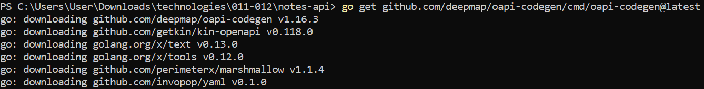

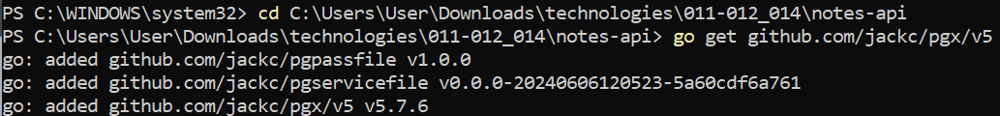

.png)

.png)

.png)

Создание БД


Добавление прав доступа


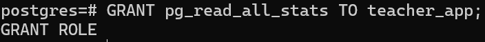

Добавление shared_preload_libraries

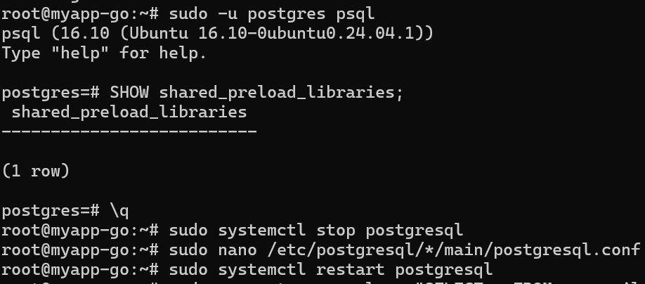


Создание файлов для подключения к БД


Запуск проекта

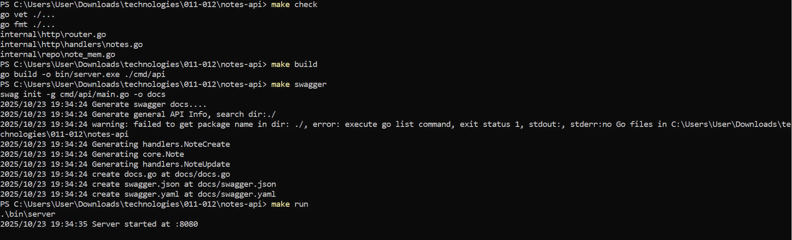

.png)

.png)

Генерация swagger-доков


Проверка и запуск приложения


Создание заметки

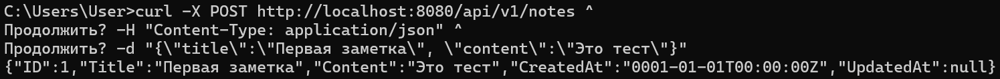

Проверка обновленных команд


EXPLAIN/ANALYZE проблемных запросов


Статистика запросов из БД


Нагрузочное тестирование


Тестирование разных размеров пула

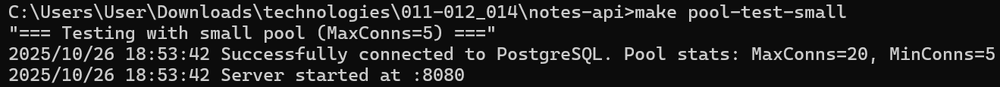


Мониторинг БД в реальном времени


Проверка обновленных команд


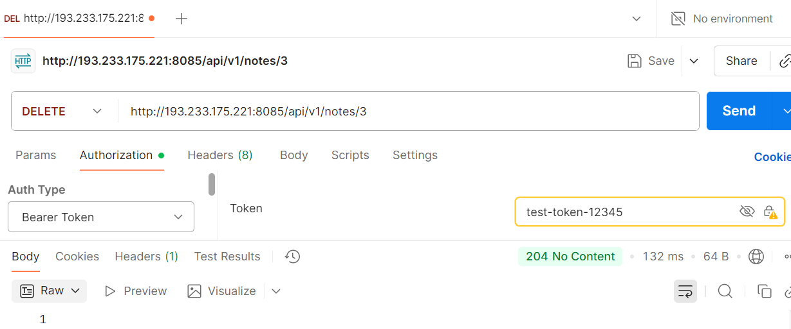

Нагрузка

.png)

.png)

.png)

Профиль

.png)

.png)

Скачанные файлы

.png)

Отображение нагрузки в Web

.png)

.png)

.png)

.png)

.png)

.png)

.png)

.png)

Отображение нагрузки в консоли

.png)

.png)

.png)

.png)

.png)

Test и новый запуск проекта

.png)

Тесты

.png)

.png)

.png)

.png)

.png)

.png)

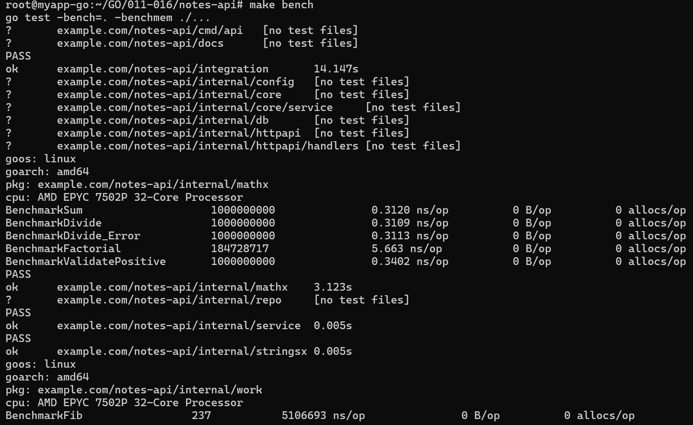

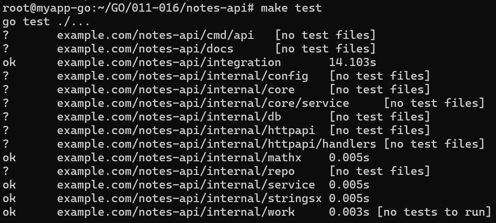

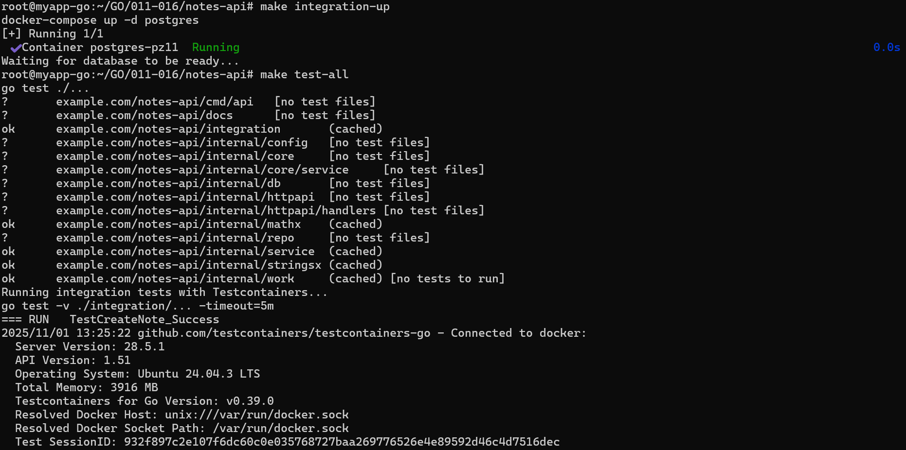

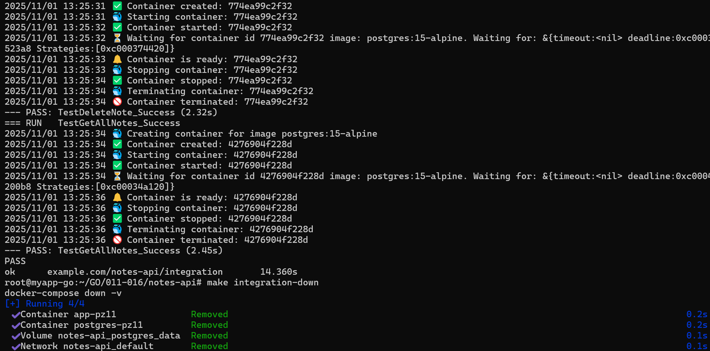

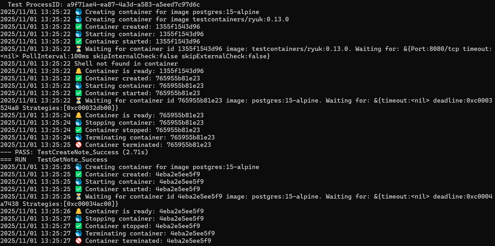

Структура проекта


.png)

.png)