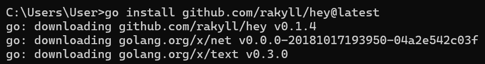
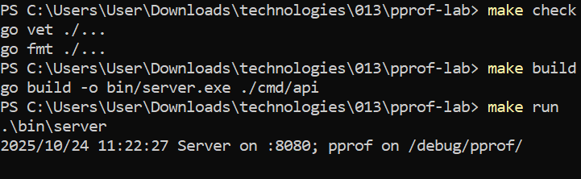
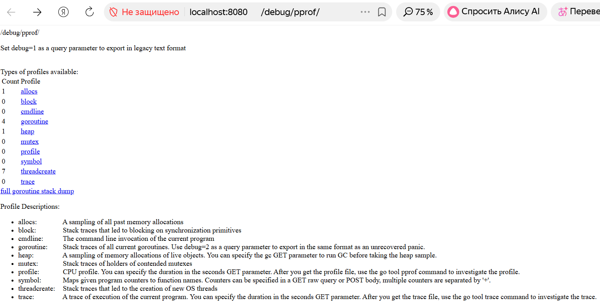
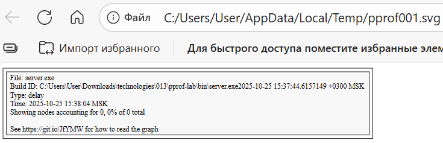
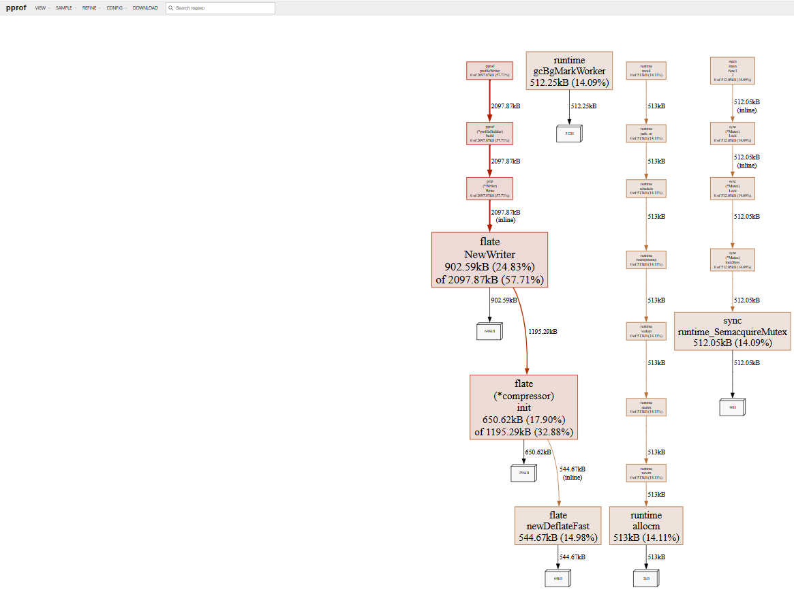
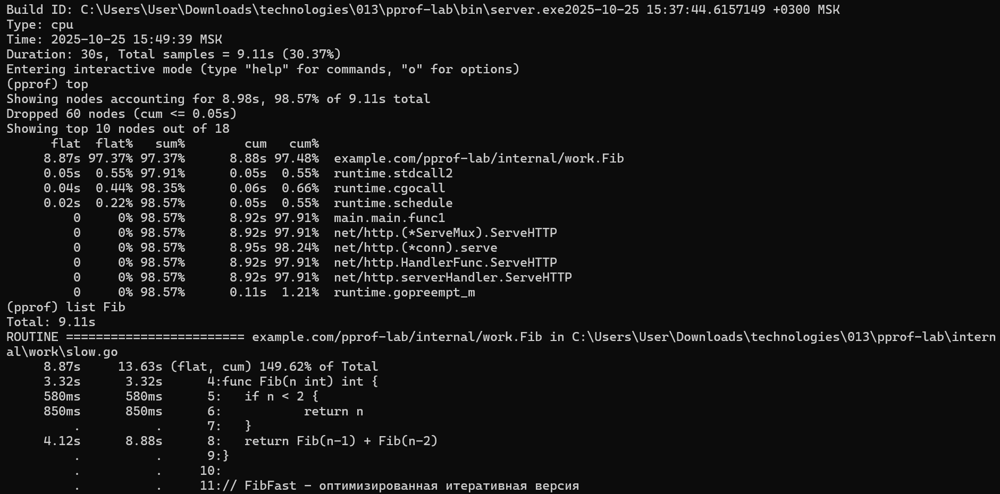
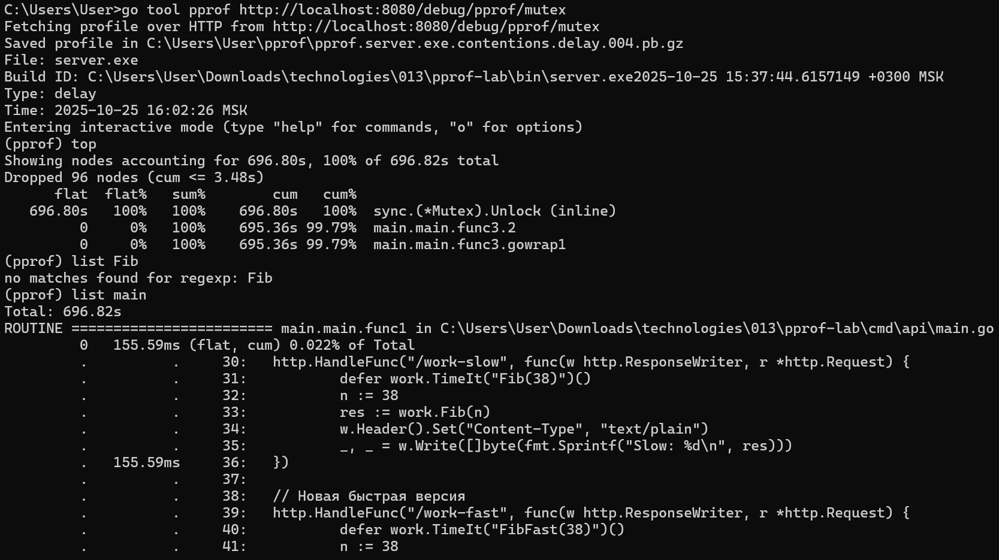
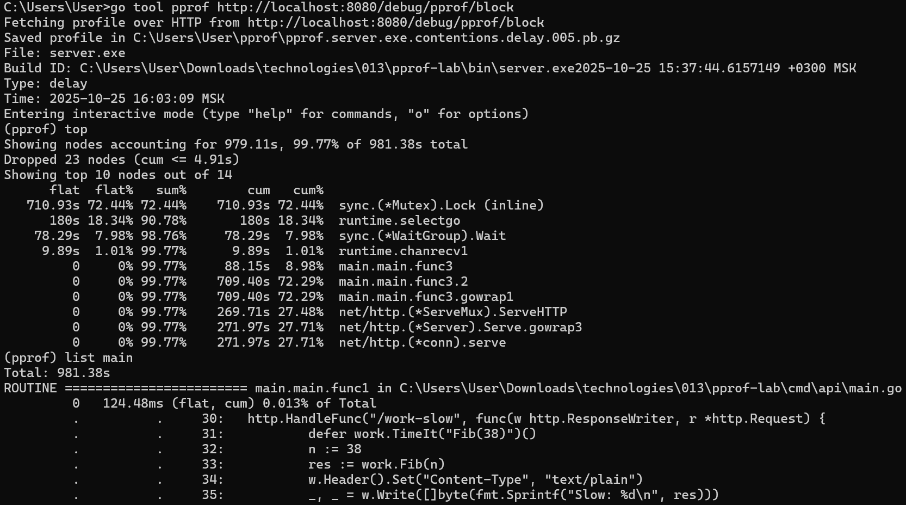

# Практическая работа №13
# Николаенко Михаил ЭФМО-02-21

## Описание проекта и требования

Проект использует инструменты профилирования Go-приложений (pprof), помогает анализировать CPU и memory профили, находить узкие места производительности и проводить оптимизацию на основе метрик.

Для работы необходим Graphiz (версия 14.0.2 и выше) -  для визуализации графов

Для работы с командой make необходимо установить менеджер пакетов Chocolatey и установить команду make

Для работы с командой hey необходимо установить эту команду - для нагрузочного тестирования

Проект на языке Go (необходима версия 1.21 и выше)

## Команды запуска/сборки

### Сборка приложения:

make build

### Запуск приложения:

make run

## Запуск бенчмарков

### Сравнение производительности

make bench

### Профилирование блокировок (через Makefile)

make profile-block

### Профилирование мьютексов (через Makefile)

make profile-mutex

## Команды:

### Нагрузка
hey -n 200 -c 8 http://localhost:8080/work

### Нагрузочное тестирование медленной версии
hey -n 200 -c 8 http://localhost:8080/work-slow

### Нагрузочное тестирование быстрой версии
hey -n 200 -c 8 http://localhost:8080/work-fast

### Тестирование блокировок
hey -n 100 -c 5 http://localhost:8080/block-demo

### Открытие страницы профиля
http://localhost:8080/debug/pprof/

### Скачивание файла profile
http://localhost:8080/debug/pprof/profile?seconds=30 

### Скачивание файла heap
http://localhost:8080/debug/pprof/heap

### Скачивание файла goroutine
http://localhost:8080/debug/pprof/goroutine

### Скачивание файла block
http://localhost:8080/debug/pprof/block

### качивание файла mutex
http://localhost:8080/debug/pprof/mutex

### Анализ CPU профиля
go tool pprof http://localhost:8080/debug/pprof/profile?seconds=30
#### “топ пожирателей CPU”
- (pprof) top
#### показать исходник с “горячими” строками
- (pprof) list main
#### сгенерировать svg с графом вызовов
- (pprof) web 

### Анализ Block профиля
go tool pprof http://localhost:8080/debug/pprof/block
#### топ операций блокировки
- (pprof) top
#### показать где происходят блокировки
- (pprof) list main   

### Анализ Mutex профиля
go tool pprof http://localhost:8080/debug/pprof/mutex
#### топ конфликтов мьютексов
- (pprof) top
#### показать где происходят блокировки мьютексов
- (pprof) list main   

### CPU профиль с веб-интерфейсом
go tool pprof -http=:9999 http://localhost:8080/debug/pprof/profile?seconds=30

### Heap профиль с веб-интерфейсом
go tool pprof -http=:9998 http://localhost:8080/debug/pprof/heap

### Block профиль с веб-интерфейсом
go tool pprof -http=:9997 http://localhost:8080/debug/pprof/block

### Mutex профиль с веб-интерфейсом
go tool pprof -http=:9996 http://localhost:8080/debug/pprof/mutex

## Структура проекта
```
C:.
│   go.mod
│   Makefile
│   README.md
│
├───bin
│       server.exe
│
├───cmd
│   └───api
│           main.go
│
├───internal
│   └───work
│           slow.go
│           slow_test.go
│           timer.go
│
└───PR13
```

## Скриншоты работы проекта

Инициализация проекта




Проверка и запуск приложения



Нагрузка


Профиль




Скачанные файлы


Отображение нагрузки в Web







Отображение нагрузки в консоли








Test и новый запуск проекта


Структура проекта

