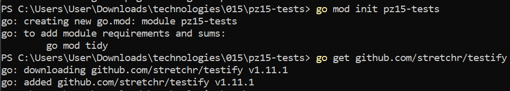
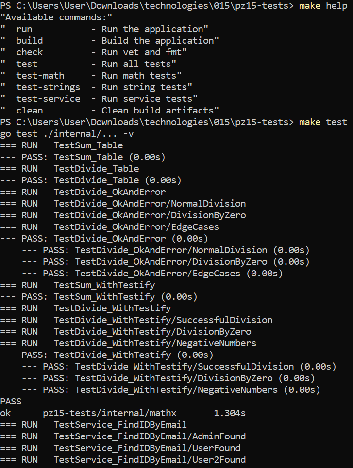
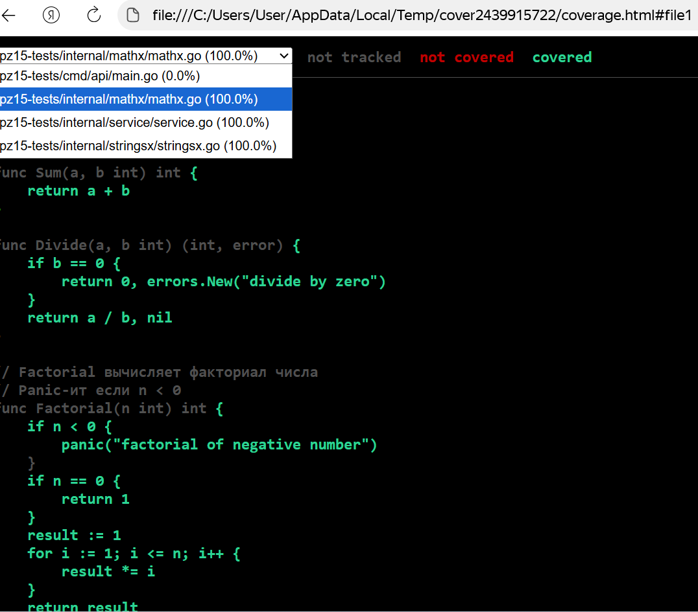

# Практическая работа №15
# Николаенко Михаил ЭФМО-02-21

## Описание проекта и требования

Проект демонстрирует принципы модульного тестирования в Go, включая табличные тесты, тестирование с использованием testify, бенчмарки, тестирование паник и изолированные unit-тесты с test doubles.

Необходим testify для assertions

Для работы с командой make в PowerShell необходимо установить менеджер пакетов Chocolatey и установить команду make

Проект на языке Go (необходима версия 1.21 и выше)

## Команды запуска/сборки

### Сборка приложения:

make build

### Запуск приложения:

make run

### Инструкция:

make help

### Команды тестирования
#### Запуск всех тестов:
make test

#### Запуск тестов с подробным выводом:
make test-v

#### Запуск тестов отдельных пакетов:
make test-math
make test-strings
make test-service

#### Бенчмарки:
make bench-math

### Проверка покрытия кода:
#### Быстрая проверка покрытия
make check-coverage

#### Детальный отчёт
make coverage-report

#### HTML отчёт покрытия
make test-coverage-html

## Структура проекта
```
C:.
│   go.mod
│   go.sum
│   Makefile
│   README.md
│
├───bin
│       server.exe
│
├───cmd
│   └───api
│           main.go
│
├───internal
│   ├───mathx
│   │       mathx.go
│   │       mathx_test.go
│   │
│   ├───service
│   │       repo.go
│   │       service.go
│   │       service_test.go
│   │
│   └───stringsx
│           stringsx.go
│           stringsx_test.go
│
└───PR15
```
## Покрытие кода:
mathx: 100% - полное покрытие всех функций и ветвлений

stringsx: 100% - покрыты все граничные случаи

service: 100% - изолированное тестирование бизнес-логики

## Скриншоты работы проекта

Инициализация проекта



Запуск и отладка приложения


Тесты






Структура проекта

